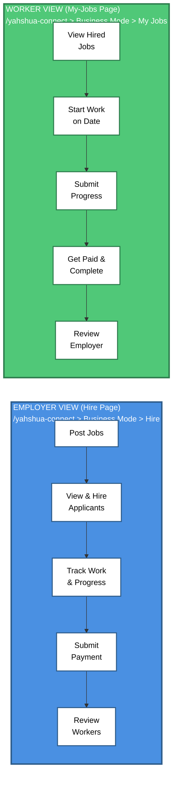
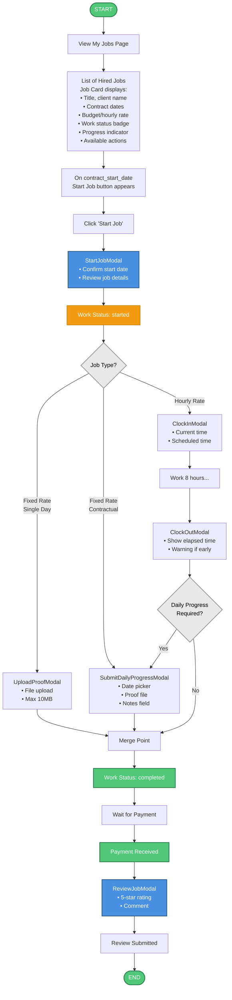

```mermaid
flowchart TD
    START([START]) --> A[Click 'Post a Job']
    A --> B[CreateBusinessJobModal Opens]

    B --> B1[Tab 1: JobInfoTab<br/>• Job Title<br/>• Category dropdown<br/>• Description textarea<br/>• Location autocomplete<br/>• Contract Start/End Dates<br/>• Is Urgent toggle]

    B1 --> B2[Tab 2: JobBudgetTab<br/>Budget Type Selection]

    B2 --> B2a{Budget Type?}

    B2a -->|Fixed Rate| B2b[• Min Amount<br/>• Max Amount<br/>• Is Proof File Required]
    B2a -->|Hourly Rate| B2c[• Hourly Rate<br/>• Time From/To<br/>• Is Strict Schedule<br/>• Clock grace periods<br/>• Is Daily Progress Required]

    B2b --> B3[Tab 3: JobPreviewTab<br/>Preview all info]
    B2c --> B3

    B3 --> C[Submit Button]
    C --> D[Job Posted<br/>Appears in job card list]

    D --> E[Applications come in<br/>Badge shows 'X applicants']
    E --> F[Click 'View Applicants']
    F --> G[ViewApplicantsModal<br/>• Avatar, name, rating<br/>• Applied date<br/>• View Profile button]

    G --> H[Click applicant name]
    H --> I[ApplicantProfileModal<br/>• Work experience<br/>• Education, Certifications<br/>• Skills, Resume<br/>• Contact info]

    I --> J[Click 'Hire']
    J --> K[ConfirmHireModal<br/>• Confirm job details<br/>• Show scheduled dates]

    K --> L[Hired!<br/>Applicant moves to Hired section]

    L --> M{Track Work<br/>Progress}

    M -->|Fixed Rate| N[ViewDailyProgressModal<br/>• Daily submissions list<br/>• View proof files<br/>• Approve/Reject buttons<br/>• Client feedback]

    M -->|Hourly Rate| O[ViewTimeLogsModal<br/>• Clock in/out records<br/>• Total hours worked<br/>• Late/early tracking]

    N --> P[Work Complete]
    O --> P

    P --> Q[Click 'Submit Payment Proof']
    Q --> R[SubmitPaymentProofModal<br/>• Payment Amount override<br/>• Upload proof file<br/>• Max 5MB]

    R --> S[Payment Submitted]
    S --> T[Click 'Review Applicant']
    T --> U[ReviewApplicantModal<br/>• 5-star rating<br/>• Comment textarea]

    U --> V[Review Submitted<br/>Job may reactivate]
    V --> END([END])

    style START fill:#50C878,stroke:#2E7D4E,stroke-width:2px,color:#fff
    style END fill:#50C878,stroke:#2E7D4E,stroke-width:2px,color:#fff
    style B fill:#4A90E2,stroke:#2E5C8A,stroke-width:2px,color:#fff
    style K fill:#F39C12,stroke:#D68910,stroke-width:2px,color:#fff
    style L fill:#50C878,stroke:#2E7D4E,stroke-width:2px,color:#fff
    style R fill:#4A90E2,stroke:#2E5C8A,stroke-width:2px,color:#fff
    style U fill:#4A90E2,stroke:#2E5C8A,stroke-width:2px,color:#fff
    style B2a fill:#E8E8E8,stroke:#999,stroke-width:2px,color:#000
    style M fill:#E8E8E8,stroke:#999,stroke-width:2px,color:#000
```

# Business Job Posting Workflow - Frontend Implementation Guide

**Last Updated:** January 24, 2026
**Version:** 1.0

## Table of Contents

1. [System Overview](#system-overview)
2. [Budget Types Comparison](#budget-types-comparison)
3. [Employer Workflow - Hire Page](#employer-workflow---hire-page)
4. [Worker Workflow - My-Jobs Page](#worker-workflow---my-jobs-page)
5. [Fixed Rate Job UI Flow](#fixed-rate-job-ui-flow)
6. [Hourly Rate Job UI Flow](#hourly-rate-job-ui-flow)
7. [Component Architecture](#component-architecture)
8. [State Management & Hooks](#state-management--hooks)
9. [Form Handling with React Hook Form](#form-handling-with-react-hook-form)
10. [Status Indicators & UI States](#status-indicators--ui-states)
11. [User Experience Flows](#user-experience-flows)
12. [Complete Integration Examples](#complete-integration-examples)
13. [API Integration Patterns](#api-integration-patterns)
14. [Type Definitions](#type-definitions)

---

## System Overview

The Business Job Posting system provides a two-sided marketplace within the YAHSHUA HRIS platform where applicants can act as both clients/employers (posting jobs) and workers (applying for jobs).

### Key Features from User Perspective

**For Employers (Hire Page):**
- Post jobs with flexible budget types (fixed rate or hourly rate)
- Review applicant profiles with ratings and work history
- Hire multiple workers per job
- Track work progress (daily submissions or time logs)
- Submit payments with proof
- Rate and review workers

**For Workers (My-Jobs Page):**
- View hired jobs with contract details
- Start work on designated date
- Submit daily progress with photo proofs (fixed rate)
- Clock in/out daily with automatic time tracking (hourly rate)
- Upload completion proof
- Rate and review employers

### Two User Perspectives



### Routes

- **Employer (Hire):** `/yahshua-connect` > Business Mode Tab > Hire Sub-tab
- **Worker (My Jobs):** `/yahshua-connect` > Business Mode Tab > My Jobs Sub-tab

---

## Budget Types Comparison

From a UI/UX perspective, the budget type determines the entire user workflow and available features.

| Feature | Fixed Rate (UI) | Hourly Rate (UI) |
|---------|-----------------|------------------|
| **Job Creation Form** | JobBudgetTab shows:<br>- Min Amount input<br>- Max Amount input<br>- Is Proof File Required toggle | JobBudgetTab shows:<br>- Hourly Rate input<br>- Time From/To pickers<br>- Is Strict Schedule toggle<br>- Clock in/out grace period inputs<br>- Is Daily Progress Required toggle |
| **Job Card Display** | Shows: "₱min - ₱max" | Shows: "₱rate/hr"<br>Scheduled time: "9:00 AM - 5:00 PM" |
| **Progress Indicator** | Progress bar:<br>"X of Y days submitted" | Time tracking:<br>"X hours worked"<br>Today's status badge |
| **Worker Actions** | - Start Job button<br>- Submit Daily Progress button<br>- Upload Proof button | - Start Job button<br>- Clock In button<br>- Clock Out button<br>- Submit Daily Progress (optional) |
| **Employer Tracking** | - ViewDailyProgressModal<br>- Approve/Reject daily work | - ViewTimeLogsModal<br>- View hours and attendance |
| **Completion Indicator** | "All X days submitted" or<br>"Proof uploaded" | "All X days clocked out" or<br>"X hours total" |
| **Status Badges** | - Scheduled (yellow)<br>- In Progress (blue)<br>- Completed (green) | - Clocked In (green)<br>- Clocked Out (gray)<br>- Completed (green) |

### When Employers Choose Each Type in UI

**Fixed Rate (Recommended for):**
- One-time tasks with clear deliverables
- Projects measured by completion, not time
- Multi-day contracts with daily check-ins

**Hourly Rate (Recommended for):**
- Shift-based work with specific hours
- Jobs requiring time tracking and attendance
- Work charged by actual hours spent

---

## Employer Workflow - Hire Page

### Complete User Journey Diagram



### Step-by-Step with Component Details

#### Step 1: Post a Job

**Component:** `CreateBusinessJobModal`

**User Actions:**
1. Click "Post a Job" button
2. Modal opens with 3-step wizard (tabs)

**Tab 1 - Job Info:**
```tsx
// JobInfoTab.tsx
<form>
  <Input label="Job Title" {...register("job_title")} />
  <Select label="Category" options={categories} {...register("category")} />
  <Textarea label="Description" {...register("description")} />
  <LocationAutocomplete {...register("location")} />
  <DatePicker label="Start Date" {...register("contract_start_date")} />
  <DatePicker label="End Date (Optional)" {...register("contract_end_date")} />
  <Toggle label="Mark as Urgent" {...register("is_urgent")} />
</form>
```

**Tab 2 - Budget:**
```tsx
// JobBudgetTab.tsx
<Controller
  name="budget_type"
  control={control}
  render={({ field }) => (
    <RadioGroup value={field.value} onChange={field.onChange}>
      <Radio value="fixed_rate">Fixed Rate</Radio>
      <Radio value="hourly_rate">Hourly Rate</Radio>
    </RadioGroup>
  )}
/>

{budgetType === 'fixed_rate' && (
  <>
    <CurrencyInput label="Min Amount" {...register("min_amount")} />
    <CurrencyInput label="Max Amount" {...register("max_amount")} />
    <Toggle label="Require Proof File" {...register("is_proof_file_required")} />
  </>
)}

{budgetType === 'hourly_rate' && (
  <>
    <CurrencyInput label="Hourly Rate" {...register("hourly_rate")} />
    <TimePicker label="Time From" {...register("time_from")} />
    <TimePicker label="Time To" {...register("time_to")} />
    <Toggle label="Strict Schedule" {...register("is_strict_schedule")} />
    <NumberInput label="Clock In Grace (minutes)" {...register("clock_in_minutes_before")} />
    <NumberInput label="Clock Out Grace (minutes)" {...register("clock_out_minutes_after")} />
    <Toggle label="Require Daily Progress" {...register("is_daily_progress_required")} />
  </>
)}
```

**Tab 3 - Preview:**
```tsx
// JobPreviewTab.tsx
<div>
  <h3>{formData.job_title}</h3>
  <p>Category: {formData.category}</p>
  <p>Location: {formData.location}</p>
  <p>Start: {formData.contract_start_date}</p>
  {formData.contract_end_date && <p>End: {formData.contract_end_date}</p>}

  {formData.budget_type === 'fixed_rate' ? (
    <p>Budget: ₱{formData.min_amount} - ₱{formData.max_amount}</p>
  ) : (
    <>
      <p>Rate: ₱{formData.hourly_rate}/hour</p>
      <p>Schedule: {formData.time_from} - {formData.time_to}</p>
    </>
  )}
</div>
```

**Hook Used:** `useCreateBusinessJob()`

```typescript
// hooks/useCreateBusinessJob.ts
import { useMutation, useQueryClient } from '@tanstack/react-query';
import { getCookie } from 'cookies-next';

async function createBusinessJob(data: T_CreateBusinessJobData): Promise<T_BusinessJobPosting> {
  const token = getCookie('token');

  const config: RequestInit = {
    method: 'POST',
    headers: {
      'Content-Type': 'application/json',
      Authorization: `Token ${token}`,
    },
    body: JSON.stringify(data),
  };

  const url = `${process.env.NEXT_PUBLIC_API_URL}/api/business-jobs/`;

  const res = await fetch(url, config);
  if (!res.ok) {
    const errorData = await res.json();
    throw new Error(errorData.message || 'Failed to create business job.');
  }

  const responseData = await res.json();
  return responseData.data || responseData;
}

export function useCreateBusinessJob() {
  const queryClient = useQueryClient();

  return useMutation<T_BusinessJobPosting, Error, T_CreateBusinessJobData>(
    (data: T_CreateBusinessJobData) => createBusinessJob(data),
    {
      onSuccess: () => {
        queryClient.invalidateQueries(['myBusinessJobsCache']);
        queryClient.invalidateQueries(['businessJobsCache']);
      },
    }
  );
}
```

---

#### Step 2: View & Hire Applicants

**Component:** `ViewApplicantsModal`

**User Actions:**
1. Click "View Applicants" badge on job card
2. Modal shows list of applicants

**UI Display:**
```tsx
// ViewApplicantsModal.tsx
<Modal open={isOpen} onClose={onClose}>
  <div className="applicant-list">
    {applicants.map((applicant) => (
      <div key={applicant.id} className="applicant-card">
        <Avatar src={applicant.photo} initials={applicant.initials} />
        <div>
          <h4>{applicant.name}</h4>
          <StarRating rating={applicant.average_rating} />
          <span>{applicant.reviews_count} reviews</span>
          <p>Applied: {formatDate(applicant.created_at)}</p>
        </div>
        <button onClick={() => viewProfile(applicant.id)}>
          View Profile
        </button>
        <button onClick={() => confirmHire(applicant.id)}>
          Hire
        </button>
      </div>
    ))}
  </div>
</Modal>
```

**Component:** `ApplicantProfileModal`

Shows full applicant details:
- Work experience timeline
- Educational background
- Certifications with dates
- Skills list
- Resume download button
- Contact information

**Component:** `ConfirmHireModal`

```tsx
// ConfirmHireModal.tsx
<Modal>
  <h3>Confirm Hire</h3>
  <p>Job: {job.job_title}</p>
  <p>Applicant: {applicant.name}</p>
  <p>Start Date: {job.contract_start_date}</p>
  {job.budget_type === 'fixed_rate' ? (
    <p>Budget: ₱{job.min_amount} - ₱{job.max_amount}</p>
  ) : (
    <>
      <p>Rate: ₱{job.hourly_rate}/hour</p>
      <p>Schedule: {job.time_from} - {job.time_to}</p>
    </>
  )}
  <button onClick={handleConfirmHire}>Confirm Hire</button>
</Modal>
```

**Hook Used:** `useUpdateApplicationStatus()`

```typescript
async function updateApplicationStatus(data: T_UpdateStatusData): Promise<T_BusinessJobApplication> {
  const token = getCookie('token');

  const config: RequestInit = {
    method: 'PATCH',
    headers: {
      'Content-Type': 'application/json',
      Authorization: `Token ${token}`,
    },
    body: JSON.stringify({ status: data.status }),
  };

  const url = `${process.env.NEXT_PUBLIC_API_URL}/api/business-jobs/applications/${data.applicationId}/status/`;

  const res = await fetch(url, config);
  if (!res.ok) {
    const errorData = await res.json();
    throw new Error(errorData.message || 'Failed to update status.');
  }

  const responseData = await res.json();
  return responseData.data || responseData;
}

export function useUpdateApplicationStatus() {
  const queryClient = useQueryClient();

  return useMutation<T_BusinessJobApplication, Error, T_UpdateStatusData>(
    (data: T_UpdateStatusData) => updateApplicationStatus(data),
    {
      onSuccess: () => {
        queryClient.invalidateQueries(['myBusinessJobsCache']);
        queryClient.invalidateQueries(['myAppliedBusinessJobs']);
      },
    }
  );
}
```

---

#### Step 3: Track Work Progress

**For Fixed Rate Jobs:**

**Component:** `ViewDailyProgressModal`

```tsx
// ViewDailyProgressModal.tsx
<Modal>
  <h3>Daily Progress - {applicant.name}</h3>
  <div className="progress-list">
    {dailyProgresses.map((progress) => (
      <div key={progress.id} className="progress-item">
        <div className="progress-date">
          {formatDate(progress.progress_date)}
        </div>
        <div className="progress-status">
          <StatusBadge status={progress.status} />
        </div>
        {progress.proof_file && (
          
        )}
        <p>{progress.notes}</p>

        {progress.status === 'submitted' && (
          <div className="actions">
            <button onClick={() => handleApprove(progress.id)}>
              Approve
            </button>
            <button onClick={() => handleReject(progress.id)}>
              Reject
            </button>
            <textarea
              placeholder="Feedback (optional)"
              value={feedback}
              onChange={(e) => setFeedback(e.target.value)}
            />
          </div>
        )}

        {progress.client_feedback && (
          <div className="feedback">
            <strong>Your Feedback:</strong>
            <p>{progress.client_feedback}</p>
          </div>
        )}
      </div>
    ))}
  </div>
</Modal>
```

**Hook Used:** `useReviewDailyProgress()`

```typescript
async function reviewDailyProgress(data: T_ReviewProgressData): Promise<T_DailyProgress> {
  const token = getCookie('token');

  const config: RequestInit = {
    method: 'PATCH',
    headers: {
      'Content-Type': 'application/json',
      Authorization: `Token ${token}`,
    },
    body: JSON.stringify({
      status: data.status, // 'approved' or 'rejected'
      client_feedback: data.client_feedback,
    }),
  };

  const url = `${process.env.NEXT_PUBLIC_API_URL}/api/business-jobs/applications/daily-progress/${data.progressId}/`;

  const res = await fetch(url, config);
  if (!res.ok) {
    const errorData = await res.json();
    throw new Error(errorData.message || 'Failed to review progress.');
  }

  const responseData = await res.json();
  return responseData.data || responseData;
}

export function useReviewDailyProgress() {
  const queryClient = useQueryClient();

  return useMutation<T_DailyProgress, Error, T_ReviewProgressData>(
    (data: T_ReviewProgressData) => reviewDailyProgress(data),
    {
      onSuccess: () => {
        queryClient.invalidateQueries(['dailyProgressCache']);
        queryClient.invalidateQueries(['myBusinessJobsCache']);
      },
    }
  );
}
```

**For Hourly Rate Jobs:**

**Component:** `ViewTimeLogsModal`

```tsx
// ViewTimeLogsModal.tsx
<Modal>
  <h3>Time Logs - {applicant.name}</h3>

  <div className="summary">
    <div className="stat">
      <label>Total Hours</label>
      <span className="value">{totalHoursWorked} hrs</span>
    </div>
    <div className="stat">
      <label>Days Worked</label>
      <span className="value">{timeRecords.length} days</span>
    </div>
    <div className="stat">
      <label>Expected Payment</label>
      <span className="value">₱{totalHoursWorked * job.hourly_rate}</span>
    </div>
  </div>

  <div className="time-records">
    <table>
      <thead>
        <tr>
          <th>Date</th>
          <th>Clock In</th>
          <th>Clock Out</th>
          <th>Hours</th>
          <th>Late</th>
          <th>Status</th>
        </tr>
      </thead>
      <tbody>
        {timeRecords.map((record) => (
          <tr key={record.id}>
            <td>{formatDate(record.record_date)}</td>
            <td>{formatTime(record.clock_in_time)}</td>
            <td>{formatTime(record.clock_out_time)}</td>
            <td>{record.actual_hours || '-'}</td>
            <td>{record.late_minutes > 0 ? `${record.late_minutes} min` : '-'}</td>
            <td><StatusBadge status={record.status} /></td>
          </tr>
        ))}
      </tbody>
    </table>
  </div>
</Modal>
```

---

#### Step 4: Submit Payment

**Component:** `SubmitPaymentProofModal`

```tsx
// SubmitPaymentProofModal.tsx
<Modal>
  <h3>Submit Payment Proof</h3>
  <p>Applicant: {applicant.name}</p>
  <p>Job: {job.job_title}</p>

  <form onSubmit={handleSubmit(onSubmit)}>
    <CurrencyInput
      label="Payment Amount (optional)"
      placeholder={suggestedAmount}
      {...register("payment_amount")}
    />

    <FileUpload
      label="Payment Proof (Receipt/Invoice)"
      accept="image/*,.pdf"
      maxSize={5 * 1024 * 1024} // 5MB
      {...register("payment_proof")}
    />

    <p className="note">
      Suggested amount: ₱{suggestedAmount}
      {job.budget_type === 'hourly_rate' && (
        <span> ({totalHoursWorked} hrs × ₱{job.hourly_rate}/hr)</span>
      )}
    </p>

    <button type="submit">Submit Payment</button>
  </form>
</Modal>
```

**Hook Used:** `useSubmitPayment()`

```typescript
async function submitPayment(data: T_SubmitPaymentData): Promise<T_BusinessJobApplication> {
  const token = getCookie('token');

  const formData = new FormData();
  if (data.payment_amount) {
    formData.append('payment_amount', data.payment_amount.toString());
  }
  if (data.payment_proof) {
    formData.append('payment_proof', data.payment_proof);
  }

  const config: RequestInit = {
    method: 'PATCH',
    headers: {
      Authorization: `Token ${token}`,
    },
    body: formData,
  };

  const url = `${process.env.NEXT_PUBLIC_API_URL}/api/business-jobs/applications/${data.applicationId}/payment/`;

  const res = await fetch(url, config);
  if (!res.ok) {
    const errorData = await res.json();
    throw new Error(errorData.message || 'Failed to submit payment.');
  }

  const responseData = await res.json();
  return responseData.data || responseData;
}

export function useSubmitPayment() {
  const queryClient = useQueryClient();

  return useMutation<T_BusinessJobApplication, Error, T_SubmitPaymentData>(
    (data: T_SubmitPaymentData) => submitPayment(data),
    {
      onSuccess: () => {
        queryClient.invalidateQueries(['myBusinessJobsCache']);
        queryClient.invalidateQueries(['myAppliedBusinessJobs']);
      },
    }
  );
}
```

---

#### Step 5: Review Worker

**Component:** `ReviewApplicantModal`

```tsx
// ReviewApplicantModal.tsx
<Modal>
  <h3>Review {applicant.name}</h3>

  <form onSubmit={handleSubmit(onSubmit)}>
    <StarRatingInput
      label="Rating"
      value={rating}
      onChange={setRating}
    />

    <Textarea
      label="Comment (optional)"
      placeholder="Share your experience working with this applicant..."
      {...register("comment")}
    />

    <button type="submit">Submit Review</button>
  </form>
</Modal>
```

**Hook Used:** `useSubmitApplicantReview()`

---

## Worker Workflow - My-Jobs Page

### Complete User Journey Diagram



### Step-by-Step with Component Details

#### Step 1: View Hired Jobs

**Component:** `Content.tsx` (My-Jobs page)

**Job Card Display:**
```tsx
// MyJobCard.tsx
<div className="job-card">
  <div className="header">
    <h3>{job.job_title}</h3>
    {job.is_urgent && <Badge color="red">Urgent</Badge>}
    <WorkStatusBadge status={application.work_status} />
  </div>

  <div className="client-info">
    <Avatar src={job.created_by_photo} />
    <span>{job.created_by_name}</span>
    <StarRating rating={job.created_by_rating} size="sm" />
  </div>

  <div className="job-details">
    <div className="detail">
      <CalendarIcon />
      <span>
        {formatDate(job.contract_start_date)}
        {job.contract_end_date && ` - ${formatDate(job.contract_end_date)}`}
      </span>
    </div>

    <div className="detail">
      <CurrencyIcon />
      {job.budget_type === 'fixed_rate' ? (
        <span>₱{job.min_amount} - ₱{job.max_amount}</span>
      ) : (
        <span>₱{job.hourly_rate}/hour</span>
      )}
    </div>

    <div className="detail">
      <LocationIcon />
      <span>{job.location}</span>
    </div>

    {job.budget_type === 'hourly_rate' && (
      <div className="detail">
        <ClockIcon />
        <span>{job.time_from} - {job.time_to}</span>
      </div>
    )}

    {application.is_contractual_job && (
      <div className="detail">
        <span>{job.contract_duration_days} contract days</span>
      </div>
    )}
  </div>

  {/* Progress Indicators */}
  {job.budget_type === 'fixed_rate' && application.is_contractual_job && (
    <div className="progress-indicator">
      <ProgressBar
        current={application.submitted_progress_count}
        total={application.total_contract_days}
        label={`${application.submitted_progress_count} of ${application.total_contract_days} days submitted`}
      />
    </div>
  )}

  {job.budget_type === 'hourly_rate' && (
    <div className="time-tracking-info">
      <div className="stat">
        <label>Total Hours</label>
        <span>{application.total_hours_worked} hrs</span>
      </div>
      <div className="stat">
        <label>Today's Status</label>
        {application.today_time_record ? (
          <StatusBadge status={application.today_time_record.status} />
        ) : (
          <span>Not clocked in</span>
        )}
      </div>
    </div>
  )}

  {/* Action Buttons */}
  <div className="actions">
    {canStartJob && (
      <button onClick={() => setShowStartModal(true)}>
        Start Job
      </button>
    )}

    {canClockIn && (
      <button onClick={() => setShowClockInModal(true)}>
        <ClockIcon /> Clock In
      </button>
    )}

    {canClockOut && (
      <button onClick={() => setShowClockOutModal(true)}>
        <ClockIcon /> Clock Out
      </button>
    )}

    {canSubmitProgress && (
      <button onClick={() => setShowProgressModal(true)}>
        Submit Daily Progress
      </button>
    )}

    {canUploadProof && (
      <button onClick={() => setShowProofModal(true)}>
        Upload Proof
      </button>
    )}

    {canReviewJob && (
      <button onClick={() => setShowReviewModal(true)}>
        Review Job
      </button>
    )}

    <button onClick={() => setShowChatModal(true)}>
      Message Client
    </button>
  </div>
</div>
```

**Hook Used:** `useGetMyAppliedJobs()`

```typescript
// hooks/useGetMyAppliedJobs.ts
async function getMyAppliedJobs(pageParam = 1, filters = {}): Promise<T_PaginatedBusinessJobs> {
  const token = getCookie('token');

  const queryParams = new URLSearchParams({
    current_page: pageParam.toString(),
    page_size: '10',
    ...filters,
  });

  const config: RequestInit = {
    method: 'GET',
    headers: {
      'Content-Type': 'application/json',
      Authorization: `Token ${token}`,
    },
  };

  const url = `${process.env.NEXT_PUBLIC_API_URL}/api/business-jobs/my-applications/?${queryParams}`;

  const res = await fetch(url, config);
  if (!res.ok) {
    throw new Error('Failed to fetch applied jobs.');
  }

  const responseData = await res.json();
  return responseData.data || responseData;
}

export function useGetMyAppliedJobs(filters = {}) {
  return useInfiniteQuery(
    ['myAppliedBusinessJobs', filters],
    ({ pageParam = 1 }) => getMyAppliedJobs(pageParam, filters),
    {
      getNextPageParam: (lastPage) => {
        if (lastPage.current_page < lastPage.total_pages) {
          return lastPage.current_page + 1;
        }
        return undefined;
      },
      refetchOnWindowFocus: false,
      keepPreviousData: true,
    }
  );
}
```

---

#### Step 2: Start Job

**Component:** `StartJobModal`

```tsx
// StartJobModal.tsx
<Modal>
  <h3>Start Job</h3>
  <p className="job-title">{job.job_title}</p>
  <p className="client">Client: {job.created_by_name}</p>

  <div className="job-summary">
    <p>Start Date: {formatDate(job.contract_start_date)}</p>
    {job.contract_end_date && (
      <p>End Date: {formatDate(job.contract_end_date)}</p>
    )}

    {job.budget_type === 'fixed_rate' ? (
      <p>Payment: ₱{job.min_amount} - ₱{job.max_amount}</p>
    ) : (
      <>
        <p>Hourly Rate: ₱{job.hourly_rate}/hour</p>
        <p>Schedule: {job.time_from} - {job.time_to}</p>
      </>
    )}
  </div>

  <p className="note">
    By starting this job, you confirm that you're ready to begin work on the scheduled date.
  </p>

  <div className="actions">
    <button onClick={onClose}>Cancel</button>
    <button onClick={handleStart} className="primary">
      Confirm Start
    </button>
  </div>
</Modal>
```

**Hook Used:** `useStartJob()` (shown earlier)

---

#### Step 3a: Upload Proof (Fixed Rate, Single Day)

**Component:** `UploadProofModal`

```tsx
// UploadProofModal.tsx
<Modal>
  <h3>Upload Proof of Completion</h3>
  <p>{job.job_title}</p>

  <form onSubmit={handleSubmit(onSubmit)}>
    <FileUploadZone
      accept="image/*,.pdf"
      maxSize={10 * 1024 * 1024} // 10MB
      onChange={(file) => setValue('proof_of_completion', file)}
    >
      {isDragActive ? (
        <p>Drop file here...</p>
      ) : (
        <div>
          <UploadIcon />
          <p>Drag & drop proof file here</p>
          <p className="small">PNG, JPG, PDF (max 10MB)</p>
        </div>
      )}
    </FileUploadZone>

    {selectedFile && (
      <div className="file-preview">
        <FileIcon />
        <span>{selectedFile.name}</span>
        <button type="button" onClick={clearFile}>
          <XIcon />
        </button>
      </div>
    )}

    <button type="submit" disabled={!selectedFile}>
      Upload Proof
    </button>
  </form>
</Modal>
```

**Hook Used:** `useUploadProofOfCompletion()`

```typescript
async function uploadProof(data: T_UploadProofData): Promise<T_BusinessJobApplication> {
  const token = getCookie('token');

  const formData = new FormData();
  formData.append('proof_of_completion', data.proof_of_completion);

  const config: RequestInit = {
    method: 'PATCH',
    headers: {
      Authorization: `Token ${token}`,
    },
    body: formData,
  };

  const url = `${process.env.NEXT_PUBLIC_API_URL}/api/business-jobs/applications/${data.applicationId}/proof/`;

  const res = await fetch(url, config);
  if (!res.ok) {
    const errorData = await res.json();
    throw new Error(errorData.message || 'Failed to upload proof.');
  }

  const responseData = await res.json();
  return responseData.data || responseData;
}

export function useUploadProofOfCompletion() {
  const queryClient = useQueryClient();

  return useMutation<T_BusinessJobApplication, Error, T_UploadProofData>(
    (data: T_UploadProofData) => uploadProof(data),
    {
      onSuccess: () => {
        queryClient.invalidateQueries(['myAppliedBusinessJobs']);
      },
    }
  );
}
```

---

#### Step 3b: Submit Daily Progress (Fixed Rate, Contractual)

**Component:** `SubmitDailyProgressModal`

```tsx
// SubmitDailyProgressModal.tsx
<Modal>
  <h3>Submit Daily Progress</h3>
  <p>{job.job_title} - {formatDate(selectedDate)}</p>

  <form onSubmit={handleSubmit(onSubmit)}>
    <DatePicker
      label="Progress Date"
      value={selectedDate}
      onChange={setSelectedDate}
      minDate={job.contract_start_date}
      maxDate={job.contract_end_date || undefined}
      disabledDates={submittedDates}
    />

    <FileUploadZone
      accept="image/*,.pdf"
      maxSize={10 * 1024 * 1024}
      onChange={(file) => setValue('proof_file', file)}
    >
      <UploadIcon />
      <p>Upload today's proof of work</p>
      <p className="small">Photos, documents, or progress screenshots</p>
    </FileUploadZone>

    <Textarea
      label="Notes"
      placeholder="Describe what you accomplished today..."
      {...register("notes")}
    />

    <button type="submit" disabled={!selectedFile}>
      Submit Progress
    </button>
  </form>
</Modal>
```

**Hook Used:** `useSubmitDailyProgress()`

```typescript
async function submitDailyProgress(data: T_SubmitProgressData): Promise<T_DailyProgress> {
  const token = getCookie('token');

  const formData = new FormData();
  formData.append('progress_date', data.progress_date);
  if (data.proof_file) {
    formData.append('proof_file', data.proof_file);
  }
  if (data.notes) {
    formData.append('notes', data.notes);
  }

  const config: RequestInit = {
    method: 'POST',
    headers: {
      Authorization: `Token ${token}`,
    },
    body: formData,
  };

  const url = `${process.env.NEXT_PUBLIC_API_URL}/api/business-jobs/applications/${data.applicationId}/daily-progress/`;

  const res = await fetch(url, config);
  if (!res.ok) {
    const errorData = await res.json();
    throw new Error(errorData.message || 'Failed to submit progress.');
  }

  const responseData = await res.json();
  return responseData.data || responseData;
}

export function useSubmitDailyProgress() {
  const queryClient = useQueryClient();

  return useMutation<T_DailyProgress, Error, T_SubmitProgressData>(
    (data: T_SubmitProgressData) => submitDailyProgress(data),
    {
      onSuccess: () => {
        queryClient.invalidateQueries(['myAppliedBusinessJobs']);
        queryClient.invalidateQueries(['dailyProgressCache']);
      },
    }
  );
}
```

---

#### Step 3c: Clock In/Out (Hourly Rate)

**Component:** `ClockInModal`

```tsx
// ClockInModal.tsx
<Modal>
  <div className="clock-in-header">
    <ClockIcon className="icon-large" />
    <h3>Clock In</h3>
  </div>

  <div className="current-time-display">
    <div className="date">{formatDate(currentDate)}</div>
    <div className="time">{formatTime(currentTime)}</div>
    <div className="day">{formatDayOfWeek(currentDate)}</div>
  </div>

  {job.time_from && job.time_to && (
    <div className="scheduled-time">
      <p>Scheduled: {job.time_from} - {job.time_to}</p>
    </div>
  )}

  <div className="actions">
    <button onClick={onClose}>Cancel</button>
    <button onClick={handleClockIn} className="primary">
      Clock In Now
    </button>
  </div>
</Modal>
```

**Hook Used:** `useClockIn()` (shown earlier)

**Component:** `ClockOutModal`

```tsx
// ClockOutModal.tsx
<Modal>
  <div className="clock-out-header">
    <ClockIcon className="icon-large" />
    <h3>Clock Out</h3>
  </div>

  <div className="time-summary">
    <div className="row">
      <label>Clocked In:</label>
      <span>{formatTime(timeRecord.clock_in_time)}</span>
    </div>
    <div className="row">
      <label>Current Time:</label>
      <span>{formatTime(currentTime)}</span>
    </div>
    <div className="row highlight">
      <label>Elapsed Time:</label>
      <span className="large">{calculateElapsedTime()}</span>
    </div>
  </div>

  {isEarlyDeparture && (
    <div className="warning">
      <WarningIcon />
      <p>You're clocking out before scheduled end time ({job.time_to})</p>
    </div>
  )}

  <div className="actions">
    <button onClick={onClose}>Cancel</button>
    <button onClick={handleClockOut} className="primary">
      Clock Out Now
    </button>
  </div>
</Modal>
```

**Hook Used:** `useClockOut()`

```typescript
async function clockOut(data: T_ClockOutData): Promise<T_TimeRecord> {
  const token = getCookie('token');

  const config: RequestInit = {
    method: 'POST',
    headers: {
      'Content-Type': 'application/json',
      Authorization: `Token ${token}`,
    },
  };

  const url = `${process.env.NEXT_PUBLIC_API_URL}/api/business-jobs/applications/${data.applicationId}/clock-out/`;

  const res = await fetch(url, config);
  if (!res.ok) {
    const errorData = await res.json();
    throw new Error(errorData.message || 'Failed to clock out.');
  }

  const responseData = await res.json();
  return responseData.data || responseData;
}

export function useClockOut() {
  const queryClient = useQueryClient();

  return useMutation<T_TimeRecord, Error, T_ClockOutData>(
    (data: T_ClockOutData) => clockOut(data),
    {
      onSuccess: () => {
        queryClient.invalidateQueries(['myAppliedBusinessJobs']);
        queryClient.invalidateQueries(['timeRecordsCache']);
      },
    }
  );
}
```

---

#### Step 4: Review Job

**Component:** `ReviewJobModal`

```tsx
// ReviewJobModal.tsx
<Modal>
  <h3>Review Job</h3>
  <p>{job.job_title}</p>
  <p className="client">Client: {job.created_by_name}</p>

  <form onSubmit={handleSubmit(onSubmit)}>
    <StarRatingInput
      label="How was your experience?"
      value={rating}
      onChange={setRating}
    />

    <Textarea
      label="Comment (optional)"
      placeholder="Share your experience with this client and job..."
      {...register("comment")}
    />

    <button type="submit">
      Submit Review
    </button>
  </form>
</Modal>
```

**Hook Used:** `useSubmitJobReview()`

---

## Fixed Rate Job UI Flow

### Job Creation Form (Employer)

**Form Fields:**
- Budget Type: Fixed Rate (selected)
- Min Amount: Currency input
- Max Amount: Currency input
- Is Proof File Required: Toggle (default: ON)

**UI State:**
```typescript
const [budgetType, setBudgetType] = useState<T_BudgetType>('fixed_rate');

{budgetType === 'fixed_rate' && (
  <div className="fixed-rate-inputs">
    <CurrencyInput
      label="Minimum Amount"
      {...register("min_amount")}
    />
    <CurrencyInput
      label="Maximum Amount"
      {...register("max_amount")}
    />
    <Toggle
      label="Require Proof File"
      checked={isProofFileRequired}
      onChange={(checked) => setValue('is_proof_file_required', checked)}
    />
  </div>
)}
```

### Worker UI - Progress Submission

**Single-Day Job:**
- Shows "Upload Proof" button when work_status === 'started'
- Opens `UploadProofModal` with file upload zone
- Max file size: 10MB
- Accepted formats: PNG, JPG, PDF

**Contractual Job (Multi-Day):**
- Shows progress bar: "X of Y days submitted"
- Shows "Submit Daily Progress" button
- Opens `SubmitDailyProgressModal` with:
  - Date picker (constrained to contract dates)
  - Excludes already-submitted dates
  - File upload for daily proof
  - Notes textarea

**Progress History:**
- "View Progress History" button
- Opens modal showing all submitted progresses
- Each entry shows:
  - Date
  - Status badge (submitted/approved/rejected)
  - Proof file thumbnail
  - Notes
  - Client feedback (if any)

---

## Hourly Rate Job UI Flow

### Job Creation Form (Employer)

**Form Fields:**
- Budget Type: Hourly Rate (selected)
- Hourly Rate: Currency input
- Time From: Time picker (24-hour format)
- Time To: Time picker
- Is Strict Schedule: Toggle
  - If ON: Shows late/early departure tracking
- Clock In Minutes Before: Number input (default: 60)
- Clock Out Minutes After: Number input (default: 60)
- Is Daily Progress Required: Toggle
  - If ON: Worker must submit progress after clock out

**UI State:**
```typescript
{budgetType === 'hourly_rate' && (
  <div className="hourly-rate-inputs">
    <CurrencyInput
      label="Hourly Rate"
      placeholder="150.00"
      {...register("hourly_rate", { required: true })}
    />

    <div className="time-range">
      <TimePicker
        label="Time From"
        {...register("time_from", { required: true })}
      />
      <TimePicker
        label="Time To"
        {...register("time_to", { required: true })}
      />
    </div>

    <div className="advanced-settings">
      <h4>Advanced Settings</h4>

      <Toggle
        label="Strict Schedule"
        description="Track lateness and early departures"
        {...register("is_strict_schedule")}
      />

      <NumberInput
        label="Clock In Grace Period (minutes)"
        description="How early worker can clock in"
        {...register("clock_in_minutes_before")}
        defaultValue={60}
      />

      <NumberInput
        label="Clock Out Grace Period (minutes)"
        description="How late worker can clock out"
        {...register("clock_out_minutes_after")}
        defaultValue={60}
      />

      <Toggle
        label="Require Daily Progress"
        description="Worker must submit daily reports"
        {...register("is_daily_progress_required")}
      />
    </div>
  </div>
)}
```

### Worker UI - Time Tracking

**Clock In Flow:**
1. Button appears: "Clock In" (green)
2. Click opens `ClockInModal`
3. Shows current date/time in large format
4. Shows scheduled time if available
5. "Clock In Now" button
6. After confirmation, creates time record
7. Button changes to: "Clocked In" (disabled) + "Clock Out" (enabled)

**During Work:**
- Card shows "Clocked In" badge (green)
- Shows elapsed time (updates every minute)
- "Clock Out" button available

**Clock Out Flow:**
1. Click "Clock Out" button
2. Opens `ClockOutModal`
3. Shows:
   - Clock in time
   - Current time
   - Elapsed time calculation
   - Warning if early departure (for strict schedule)
4. "Clock Out Now" button
5. After confirmation:
   - Calculates actual hours (minus lunch)
   - Updates time record
   - If daily progress required, prompts to submit
   - Shows total hours worked

**Time Display:**
```tsx
<div className="time-tracking-card">
  <div className="today-status">
    {todayTimeRecord ? (
      todayTimeRecord.status === 'clocked_in' ? (
        <>
          <span className="badge green">Clocked In</span>
          <span className="time">{formatTime(todayTimeRecord.clock_in_time)}</span>
          <span className="elapsed">{calculateElapsedTime(todayTimeRecord.clock_in_time)}</span>
        </>
      ) : (
        <>
          <span className="badge gray">Clocked Out Today</span>
          <span className="hours">{todayTimeRecord.actual_hours} hours worked</span>
        </>
      )
    ) : (
      <span className="badge gray">Not clocked in today</span>
    )}
  </div>

  <div className="total-stats">
    <div className="stat">
      <label>Total Hours</label>
      <span className="value">{application.total_hours_worked}</span>
    </div>
    <div className="stat">
      <label>Days Worked</label>
      <span className="value">{application.total_time_records_count}</span>
    </div>
  </div>
</div>
```

---

## Component Architecture

### Component Hierarchy

**Hire Page:**

```mermaid
graph TD
    Content[Content.tsx<br/>Main Container]

    Content --> JobCard[BusinessJobPostingCard<br/>Multiple instances]
    JobCard --> JobInfo[Job Info Display]
    JobCard --> ApplicantsBadge[Applicants Badge]
    JobCard --> HiredSection[Hired Workers Section]
    HiredSection --> HiredCard[HiredApplicantCard<br/>Multiple]
    JobCard --> MoreMenu[More Menu<br/>Edit, Delete, Duplicate]

    Content --> CreateModal[CreateBusinessJobModal]
    CreateModal --> CreateTab1[JobInfoTab]
    CreateModal --> CreateTab2[JobBudgetTab]
    CreateModal --> CreateTab3[JobPreviewTab]

    Content --> UpdateModal[UpdateBusinessJobModal<br/>Same tabs as Create]

    Content --> ViewAppsModal[ViewApplicantsModal]
    ViewAppsModal --> AppCard[ApplicantCard<br/>Multiple]
    AppCard -.Click View Profile.-> ProfileModal[ApplicantProfileModal]

    Content --> HireModal[ConfirmHireModal]

    Content --> ProgressModal[ViewDailyProgressModal]
    ProgressModal --> ProgressCard[DailyProgressCard<br/>Multiple]
    ProgressCard --> ApproveReject[Approve/Reject Actions]

    Content --> TimeModal[ViewTimeLogsModal]
    TimeModal --> TimeTable[TimeRecordTable]

    Content --> PaymentModal[SubmitPaymentProofModal]

    Content --> ReviewModal[ReviewApplicantModal]

    style Content fill:#4A90E2,stroke:#2E5C8A,stroke-width:3px,color:#fff
    style CreateModal fill:#50C878,stroke:#2E7D4E,stroke-width:2px,color:#fff
    style UpdateModal fill:#50C878,stroke:#2E7D4E,stroke-width:2px,color:#fff
    style ViewAppsModal fill:#F39C12,stroke:#D68910,stroke-width:2px,color:#fff
    style HireModal fill:#F39C12,stroke:#D68910,stroke-width:2px,color:#fff
    style ProgressModal fill:#9B59B6,stroke:#7D3C98,stroke-width:2px,color:#fff
    style TimeModal fill:#9B59B6,stroke:#7D3C98,stroke-width:2px,color:#fff
    style PaymentModal fill:#E74C3C,stroke:#C0392B,stroke-width:2px,color:#fff
    style ReviewModal fill:#E74C3C,stroke:#C0392B,stroke-width:2px,color:#fff
```


**My-Jobs Page:**

```mermaid
graph TD
    Content2[Content.tsx<br/>Main Container]

    Content2 --> ActiveCard[ActiveJobCard<br/>Multiple instances]
    ActiveCard --> JobDetails[Job Details]
    ActiveCard --> ProgressInd[Progress Indicator]
    ActiveCard --> ActionBtns[Action Buttons<br/>context-dependent]
    ActiveCard --> PaymentBanner[Payment Status Banner]

    Content2 --> StartModal[StartJobModal]

    Content2 --> DailyProgModal[SubmitDailyProgressModal]
    DailyProgModal --> DateFile[DatePicker + FileUpload]

    Content2 --> ProofModal[UploadProofModal]
    ProofModal --> FileZone[FileUploadZone]

    Content2 --> ClockInMod[ClockInModal]
    ClockInMod --> TimeDisplay[Current Time Display]

    Content2 --> ClockOutMod[ClockOutModal]
    ClockOutMod --> ElapsedTime[Elapsed Time Summary]

    Content2 --> ProgHistModal[ViewProgressHistoryModal]
    ProgHistModal --> ProgList[ProgressList]

    Content2 --> TimeLogs[ViewTimeLogsModal]
    TimeLogs --> TimeTable2[TimeRecordTable]

    Content2 --> ReviewJob[ReviewJobModal]
    ReviewJob --> StarComment[StarRating + Comment]

    style Content2 fill:#4A90E2,stroke:#2E5C8A,stroke-width:3px,color:#fff
    style StartModal fill:#50C878,stroke:#2E7D4E,stroke-width:2px,color:#fff
    style DailyProgModal fill:#9B59B6,stroke:#7D3C98,stroke-width:2px,color:#fff
    style ProofModal fill:#9B59B6,stroke:#7D3C98,stroke-width:2px,color:#fff
    style ClockInMod fill:#F39C12,stroke:#D68910,stroke-width:2px,color:#fff
    style ClockOutMod fill:#F39C12,stroke:#D68910,stroke-width:2px,color:#fff
    style ProgHistModal fill:#95A5A6,stroke:#7F8C8D,stroke-width:2px,color:#fff
    style TimeLogs fill:#95A5A6,stroke:#7F8C8D,stroke-width:2px,color:#fff
    style ReviewJob fill:#E74C3C,stroke:#C0392B,stroke-width:2px,color:#fff
```


### Shared Components

```typescript
// Reusable UI Components
- StatusBadge (work_status, payment_status, etc.)
- ProgressBar (for contractual fixed rate jobs)
- StarRating (display ratings)
- StarRatingInput (input ratings)
- FileUploadZone (drag & drop)
- Avatar (user photos)
- ConfirmModal (generic confirmations)
- CustomToast (success/error notifications)
```

---

## State Management & Hooks

### TanStack Query Setup

**Cache Keys:**
```typescript
// Query Keys
'myBusinessJobsCache'        // Employer's posted jobs
'myAppliedBusinessJobs'      // Worker's hired jobs
'businessJobsCache'          // Public job listings
'dailyProgressCache'         // Daily progress records
'timeRecordsCache'           // Time records for hourly jobs
'applicantProfileCache'      // Applicant profile data
```

**Query Hook Pattern:**
```typescript
export function useGetMyBusinessJobs(filters = {}) {
  return useInfiniteQuery(
    ['myBusinessJobsCache', filters],
    ({ pageParam = 1 }) => getMyBusinessJobs(pageParam, filters),
    {
      getNextPageParam: (lastPage) => {
        if (lastPage.current_page < lastPage.total_pages) {
          return lastPage.current_page + 1;
        }
        return undefined;
      },
      refetchOnWindowFocus: false,
      keepPreviousData: true,
    }
  );
}
```

**Mutation Hook Pattern:**
```typescript
export function useCreateBusinessJob() {
  const queryClient = useQueryClient();

  return useMutation<T_BusinessJobPosting, Error, T_CreateBusinessJobData>(
    (data: T_CreateBusinessJobData) => createBusinessJob(data),
    {
      onSuccess: () => {
        // Invalidate related queries
        queryClient.invalidateQueries(['myBusinessJobsCache']);
        queryClient.invalidateQueries(['businessJobsCache']);
      },
    }
  );
}
```

### Infinite Scroll Pagination

```typescript
const {
  data,
  fetchNextPage,
  hasNextPage,
  isFetchingNextPage,
  isLoading,
} = useGetMyAppliedJobs(filters);

// Flatten pages
const jobs = data?.pages.flatMap((page) => page.data) || [];

// Load more button
{hasNextPage && (
  <button onClick={() => fetchNextPage()} disabled={isFetchingNextPage}>
    {isFetchingNextPage ? 'Loading...' : 'Load More'}
  </button>
)}
```

### Cache Invalidation Strategy

**After Create:**
- Invalidate `myBusinessJobsCache`
- Invalidate `businessJobsCache`

**After Update:**
- Invalidate `myBusinessJobsCache`
- Invalidate specific job query

**After Hire/Status Change:**
- Invalidate `myBusinessJobsCache`
- Invalidate `myAppliedBusinessJobs`

**After Clock In/Out:**
- Invalidate `myAppliedBusinessJobs`
- Invalidate `timeRecordsCache`

**After Daily Progress:**
- Invalidate `myAppliedBusinessJobs`
- Invalidate `dailyProgressCache`

---

## Form Handling with React Hook Form

### Create Job Form Example

```typescript
// CreateBusinessJobModal.tsx
import { useForm, Controller } from 'react-hook-form';

type T_CreateJobFormData = {
  job_title: string;
  category: string;
  description: string;
  location: string;
  latitude?: number;
  longitude?: number;
  budget_type: T_BudgetType;
  min_amount?: number;
  max_amount?: number;
  hourly_rate?: number;
  contract_start_date: string;
  contract_end_date?: string;
  time_from?: string;
  time_to?: string;
  is_urgent: boolean;
  is_proof_file_required: boolean;
  is_daily_progress_required: boolean;
  is_daily_progress_approval_required: boolean;
  is_strict_schedule: boolean;
  clock_in_minutes_before: number;
  clock_out_minutes_after: number;
};

export default function CreateBusinessJobModal() {
  const formMethods = useForm<T_CreateJobFormData>({
    defaultValues: {
      budget_type: 'fixed_rate',
      is_urgent: false,
      is_proof_file_required: true,
      is_daily_progress_approval_required: true,
      is_strict_schedule: false,
      clock_in_minutes_before: 60,
      clock_out_minutes_after: 60,
    },
  });

  const { control, register, handleSubmit, watch, setValue, formState: { errors } } = formMethods;

  const budgetType = watch('budget_type');
  const createJobMutation = useCreateBusinessJob();

  const onSubmit = handleSubmit(async (data) => {
    try {
      await createJobMutation.mutateAsync(data);
      toast.success('Job posted successfully!');
      onClose();
    } catch (error) {
      toast.error(error.message || 'Failed to post job');
    }
  });

  return (
    <Modal open={isOpen} onClose={onClose}>
      <form onSubmit={onSubmit}>
        {/* Form fields */}
      </form>
    </Modal>
  );
}
```

### Dynamic Field Validation

```typescript
// Conditional validation based on budget type
const { register } = useForm({
  resolver: yupResolver(
    yup.object().shape({
      budget_type: yup.string().required(),
      min_amount: yup.number().when('budget_type', {
        is: 'fixed_rate',
        then: yup.number().positive().nullable(),
      }),
      hourly_rate: yup.number().when('budget_type', {
        is: 'hourly_rate',
        then: yup.number().positive().required('Hourly rate is required'),
      }),
      time_from: yup.string().when('budget_type', {
        is: 'hourly_rate',
        then: yup.string().required('Start time is required'),
      }),
      time_to: yup.string().when('budget_type', {
        is: 'hourly_rate',
        then: yup.string().required('End time is required'),
      }),
    })
  ),
});
```

---

## Status Indicators & UI States

### Status Badge Component

```typescript
// StatusBadge.tsx
type T_StatusType = T_WorkStatus | T_PaymentStatus | T_ApplicationStatus | T_DailyProgressStatus | T_TimeRecordStatus;

const statusColors: Record<T_StatusType, string> = {
  // Work Status
  'not_started': 'gray',
  'started': 'blue',
  'completed': 'green',

  // Payment Status
  'pending': 'yellow',
  'paid': 'green',
  'cancelled': 'red',

  // Application Status
  'pending': 'yellow',
  'accepted': 'green',
  'rejected': 'red',
  'withdrawn': 'gray',

  // Daily Progress Status
  'submitted': 'yellow',
  'approved': 'green',
  'rejected': 'red',

  // Time Record Status
  'clocked_in': 'green',
  'clocked_out': 'gray',
};

export function StatusBadge({ status }: { status: T_StatusType }) {
  const color = statusColors[status];

  return (
    <span className={`badge badge-${color}`}>
      {status.replace(/_/g, ' ').toUpperCase()}
    </span>
  );
}
```

### Conditional Rendering Based on Status

```typescript
// Determine available actions based on current state
const canStartJob =
  application.status === 'accepted' &&
  application.work_status === 'not_started' &&
  isOnOrAfter(currentDate, job.contract_start_date);

const canClockIn =
  application.work_status === 'started' &&
  job.budget_type === 'hourly_rate' &&
  !todayTimeRecord;

const canClockOut =
  application.work_status === 'started' &&
  job.budget_type === 'hourly_rate' &&
  todayTimeRecord?.status === 'clocked_in';

const canSubmitProgress =
  application.work_status === 'started' &&
  application.is_contractual_job &&
  (job.budget_type === 'fixed_rate' || job.is_daily_progress_required);

const canUploadProof =
  application.work_status === 'started' &&
  job.budget_type === 'fixed_rate' &&
  !application.is_contractual_job;

const canReviewJob =
  application.work_status === 'completed' &&
  application.payment_status === 'paid' &&
  !hasReviewed;
```

---

## User Experience Flows

### Employer Journey Map

```
POST JOB → HIRE WORKERS → TRACK PROGRESS → PAY → REVIEW → REACTIVATE
   │           │              │              │       │          │
   ▼           ▼              ▼              ▼       ▼          ▼
Create     Review          Monitor        Submit  Rate &    Job ready
3-step   applicants       daily work     payment  review    for next
wizard   & hire           or time logs    proof  workers    batch
```

**Decision Points:**
1. **Budget Type Choice:** Fixed rate vs hourly rate
2. **Hiring Decision:** Review profile, accept or reject
3. **Progress Review:** Approve or reject daily work (fixed rate)
4. **Payment Amount:** Use suggested or custom amount

### Worker Journey Map

```
HIRED → START → WORK → COMPLETE → GET PAID → REVIEW
  │       │       │        │          │          │
  ▼       ▼       ▼        ▼          ▼          ▼
Wait   Confirm  Submit   Upload/  Receive   Rate &
for    on      daily    clock    payment   review
start  start   progress  out              employer
date   date    or time
```

**Decision Points:**
1. **Work Method:** Submit progress vs clock in/out (depends on job type)
2. **Daily Actions:** What to submit each day
3. **Review Content:** How to rate the experience

### Decision Tree: When to Submit Progress vs Upload Proof

```
Is job started?
   │
   ├─ NO → Cannot submit anything yet
   │
   └─ YES → Is it fixed rate or hourly rate?
             │
             ├─ Fixed Rate → Is there a contract_end_date?
             │               │
             │               ├─ NO (single day) → Upload Proof of Completion
             │               │
             │               └─ YES (contractual) → Submit Daily Progress for each day
             │
             └─ Hourly Rate → Clock in/out daily
                             │
                             └─ Is daily progress required?
                                │
                                ├─ NO → Just clock in/out
                                │
                                └─ YES → Clock in/out + Submit Daily Progress
```

---

## Complete Integration Examples

### Example 1: Fixed Rate Job with Daily Progress

**Scenario:** 30-day cleaning contract

**Employer Integration:**
```typescript
// PostJobFlow.tsx
const PostJobFlow = () => {
  const createJobMutation = useCreateBusinessJob();

  const handleSubmit = async (data) => {
    await createJobMutation.mutateAsync({
      job_title: "Daily Office Cleaning - March 2026",
      budget_type: "fixed_rate",
      min_amount: "15000",
      max_amount: "20000",
      contract_start_date: "2026-03-01",
      contract_end_date: "2026-03-30",
      is_daily_progress_required: true,  // Enable daily progress
      is_daily_progress_approval_required: true,  // Require approval
      // ... other fields
    });
  };

  return <CreateBusinessJobModal onSubmit={handleSubmit} />;
};

// TrackProgressFlow.tsx
const TrackProgressFlow = ({ jobId }) => {
  const { data: dailyProgresses } = useGetDailyProgress(jobId);
  const reviewMutation = useReviewDailyProgress();

  const handleApprove = async (progressId) => {
    await reviewMutation.mutateAsync({
      progressId,
      status: 'approved',
      client_feedback: 'Great work!',
    });
  };

  return <ViewDailyProgressModal progresses={dailyProgresses} onApprove={handleApprove} />;
};
```

**Worker Integration:**
```typescript
// MyJobsFlow.tsx
const MyJobsFlow = () => {
  const { data } = useGetMyAppliedJobs();
  const submitProgressMutation = useSubmitDailyProgress();

  const handleSubmitProgress = async (applicationId, date, file, notes) => {
    await submitProgressMutation.mutateAsync({
      applicationId,
      progress_date: date,
      proof_file: file,
      notes: notes,
    });
  };

  return (
    <div>
      {jobs.map((job) => (
        <ActiveJobCard
          job={job}
          onSubmitProgress={handleSubmitProgress}
        />
      ))}
    </div>
  );
};
```

---

### Example 2: Hourly Rate Job with Clock In/Out

**Scenario:** Office assistant, 9 AM - 5 PM, Mon-Fri

**Employer Integration:**
```typescript
const handleSubmit = async (data) => {
  await createJobMutation.mutateAsync({
    job_title: "Office Assistant - February 2026",
    budget_type: "hourly_rate",
    hourly_rate: "150",
    time_from: "09:00",
    time_to: "17:00",
    contract_start_date: "2026-02-03",
    contract_end_date: "2026-02-28",
    is_strict_schedule: true,  // Track lateness
    clock_in_minutes_before: 60,
    clock_out_minutes_after: 60,
    is_daily_progress_required: false,  // Just time tracking
    // ... other fields
  });
};
```

**Worker Integration:**
```typescript
// ClockInOutFlow.tsx
const ClockInOutFlow = ({ application }) => {
  const clockInMutation = useClockIn();
  const clockOutMutation = useClockOut();

  const handleClockIn = async () => {
    await clockInMutation.mutateAsync({
      applicationId: application.id,
    });
    toast.success('Clocked in successfully!');
  };

  const handleClockOut = async () => {
    await clockOutMutation.mutateAsync({
      applicationId: application.id,
    });
    toast.success('Clocked out successfully!');
  };

  return (
    <div>
      {!todayTimeRecord && (
        <button onClick={handleClockIn}>Clock In</button>
      )}
      {todayTimeRecord?.status === 'clocked_in' && (
        <button onClick={handleClockOut}>Clock Out</button>
      )}
    </div>
  );
};
```

---

### Example 3: Handling Both Budget Types in Same Component

```typescript
// UniversalJobCard.tsx
const UniversalJobCard = ({ job, application }) => {
  const isFix edRate = job.budget_type === 'fixed_rate';
  const isHourlyRate = job.budget_type === 'hourly_rate';

  return (
    <div className="job-card">
      {/* Budget Display */}
      <div className="budget">
        {isFixedRate ? (
          <span>₱{job.min_amount} - ₱{job.max_amount}</span>
        ) : (
          <>
            <span>₱{job.hourly_rate}/hour</span>
            <span className="schedule">{job.time_from} - {job.time_to}</span>
          </>
        )}
      </div>

      {/* Progress Indicator */}
      {isFixedRate && application.is_contractual_job && (
        <ProgressBar
          current={application.submitted_progress_count}
          total={application.total_contract_days}
        />
      )}

      {isHourlyRate && (
        <div className="time-stats">
          <span>Total Hours: {application.total_hours_worked}</span>
          {todayTimeRecord && (
            <StatusBadge status={todayTimeRecord.status} />
          )}
        </div>
      )}

      {/* Actions */}
      {renderActions()}
    </div>
  );
};
```

---

## API Integration Patterns

### Custom Hook Structure

All API hooks follow this pattern:

```typescript
// 1. Define async function for API call
async function apiFunction(data: T_RequestData): Promise<T_ResponseData> {
  const token = getCookie('token');

  const config: RequestInit = {
    method: 'POST', // or GET, PATCH, DELETE
    headers: {
      'Content-Type': 'application/json',
      Authorization: `Token ${token}`,
    },
    body: JSON.stringify(data), // Omit for GET
  };

  const url = `${process.env.NEXT_PUBLIC_API_URL}/api/endpoint/`;

  const res = await fetch(url, config);
  if (!res.ok) {
    const errorData = await res.json();
    throw new Error(errorData.message || 'Operation failed.');
  }

  const responseData = await res.json();
  return responseData.data || responseData;
}

// 2. Create custom hook using useMutation or useQuery
export function useApiFunction() {
  const queryClient = useQueryClient();

  return useMutation<T_ResponseData, Error, T_RequestData>(
    (data: T_RequestData) => apiFunction(data),
    {
      onSuccess: () => {
        // Invalidate related queries
        queryClient.invalidateQueries(['cacheKey']);
      },
    }
  );
}
```

### Error Handling Pattern

```typescript
// In component
const mutation = useCreateBusinessJob();

const handleSubmit = async (data) => {
  try {
    await mutation.mutateAsync(data);

    // Success
    toast.custom((t) => (
      <CustomToast
        type="success"
        title="Success"
        message="Job posted successfully!"
        onDismiss={() => toast.dismiss(t.id)}
      />
    ));

    onClose();
  } catch (error: any) {
    // Error
    toast.custom((t) => (
      <CustomToast
        type="error"
        title="Error"
        message={error.message || 'Failed to post job.'}
        onDismiss={() => toast.dismiss(t.id)}
      />
    ));
  }
};
```

### File Upload Pattern

```typescript
async function uploadWithFile(data: T_UploadData): Promise<T_Response> {
  const token = getCookie('token');

  // Use FormData for file uploads
  const formData = new FormData();
  formData.append('field_name', data.field_value);
  formData.append('file_field', data.file);  // File object

  const config: RequestInit = {
    method: 'PATCH', // or POST
    headers: {
      // DO NOT set Content-Type for FormData
      Authorization: `Token ${token}`,
    },
    body: formData,
  };

  const url = `${process.env.NEXT_PUBLIC_API_URL}/api/endpoint/`;

  const res = await fetch(url, config);
  // ... error handling
}
```

---

## Type Definitions

### Core Types

```typescript
// Budget Type
export type T_BudgetType = 'fixed_rate' | 'hourly_rate';

// Job Status
export type T_JobStatus = 'active' | 'in_progress' | 'completed' | 'cancelled';

// Application Status
export type T_ApplicationStatus = 'pending' | 'accepted' | 'rejected' | 'withdrawn';

// Work Status
export type T_WorkStatus = 'not_started' | 'started' | 'completed';

// Payment Status
export type T_PaymentStatus = 'pending' | 'paid' | 'cancelled';

// Daily Progress Status
export type T_DailyProgressStatus = 'submitted' | 'approved' | 'rejected';

// Time Record Status
export type T_TimeRecordStatus = 'clocked_in' | 'clocked_out';
```

### Business Job Posting Type

```typescript
export type T_BusinessJobPosting = {
  id: number;
  created_by: number;
  created_by_name: string;
  created_by_photo: string | null;
  created_by_rating: number | null;
  created_by_reviews_count: number;
  job_title: string;
  category: string | null;
  description: string;
  location: string;
  latitude: number | null;
  longitude: number | null;
  distance_km: number | null;
  budget_type: T_BudgetType;
  min_amount: number | null;
  max_amount: number | null;
  hourly_rate: number | null;
  contract_start_date: string;
  contract_end_date: string | null;
  contract_duration_days: number | null;
  time_from: string | null;
  time_to: string | null;
  status: T_JobStatus;
  current_batch_number: number;
  is_urgent: boolean;
  is_active: boolean;
  is_proof_file_required: boolean;
  is_daily_progress_required: boolean;
  is_daily_progress_approval_required: boolean;
  is_strict_schedule: boolean;
  clock_in_minutes_before: number;
  clock_out_minutes_after: number;
  applications_count: number;
  average_rating: number | null;
  reviews_count: number;
  has_applied: boolean;
  applications: T_BusinessJobApplication[];
  created_at: string;
  updated_at: string;
};
```

### Business Job Application Type

```typescript
export type T_BusinessJobApplication = {
  id: number;
  business_job_posting: number;
  applicant: number;
  applicant_name: string;
  applicant_photo: string | null;
  status: T_ApplicationStatus;
  batch_number: number;
  work_status: T_WorkStatus;
  started_at: string | null;
  completed_at: string | null;
  payment_status: T_PaymentStatus;
  payment_amount: number | null;
  paid_at: string | null;
  payment_proof: string | null;
  proof_of_completion: string | null;
  is_contractual_job: boolean;
  total_contract_days: number;
  submitted_progress_count: number;
  approved_progress_count: number;
  total_time_records_count: number;
  total_hours_worked: number;
  today_time_record: T_TimeRecord | null;
  created_at: string;
  updated_at: string;
};
```

### Daily Progress Type

```typescript
export type T_DailyProgress = {
  id: number;
  business_job_application_id: number;
  progress_date: string;
  proof_file: string | null;
  notes: string | null;
  status: T_DailyProgressStatus;
  client_feedback: string | null;
  submitted_at: string;
  reviewed_at: string | null;
};
```

### Time Record Type

```typescript
export type T_TimeRecord = {
  id: number;
  business_job_application_id: number;
  record_date: string;
  clock_in_time: string | null;
  clock_out_time: string | null;
  expected_hours: number;
  actual_hours: number | null;
  late_minutes: number;
  early_departure_minutes: number;
  status: T_TimeRecordStatus;
  created_at: string;
  updated_at: string;
};
```

### Request/Response Types

```typescript
// Create Job
export type T_CreateBusinessJobData = Omit<T_BusinessJobPosting, 'id' | 'created_by' | 'created_at' | 'updated_at' | /* computed fields */>;

// Clock In
export type T_ClockInData = {
  applicationId: number;
};

export type T_ClockInResponse = {
  success: boolean;
  message: string;
  data: T_TimeRecord;
  server_timezone: string;
  server_time: string;
};

// Submit Daily Progress
export type T_SubmitProgressData = {
  applicationId: number;
  progress_date: string;
  proof_file?: File;
  notes?: string;
};

// Review Daily Progress
export type T_ReviewProgressData = {
  progressId: number;
  status: 'approved' | 'rejected';
  client_feedback?: string;
};
```

---

## Conclusion

This comprehensive frontend workflow guide covers the complete business job posting system from the UI/UX perspective. The system provides a seamless two-sided marketplace experience where applicants can act as both employers and workers, with flexible budget types, progress tracking, time management, and payment handling.

**Key Implementation Points:**

1. **Two Budget Types** with distinct UI flows and components
2. **React Hook Form** for all form handling with dynamic validation
3. **TanStack Query** for data fetching, caching, and invalidation
4. **Custom Hooks** following consistent patterns for API integration
5. **Modal-Based UI** for all major interactions
6. **Status-Driven Actions** with conditional rendering based on current state
7. **Type-Safe** TypeScript implementation throughout

For backend API details and business logic, see the companion guide: `yahshua-hris-be/docs/business-job-posting-workflow.md`

---

**Related Documentation:**
- [App Router](./01-app-router.md)
- [Authentication](./02-authentication.md)
- [State Management](./03-state-management.md)
- [Hooks](./06-hooks.md)
- [Job Management](./08-job-management.md)
