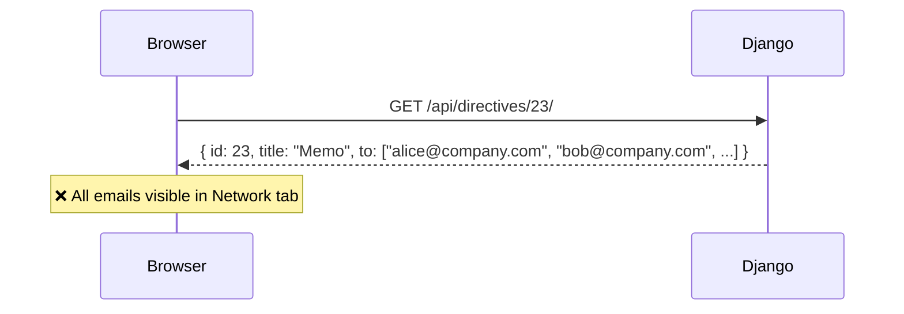
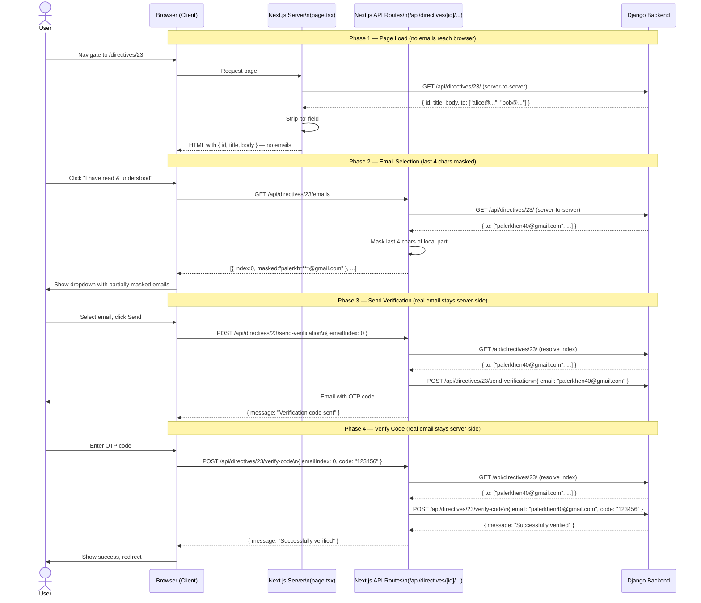
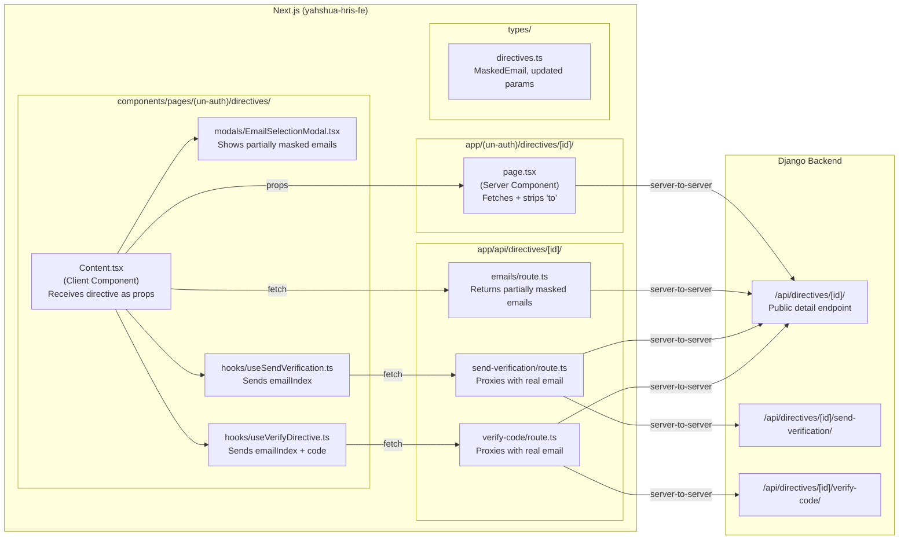
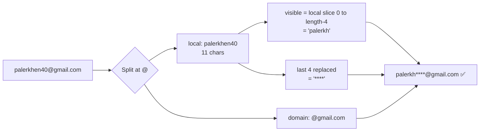
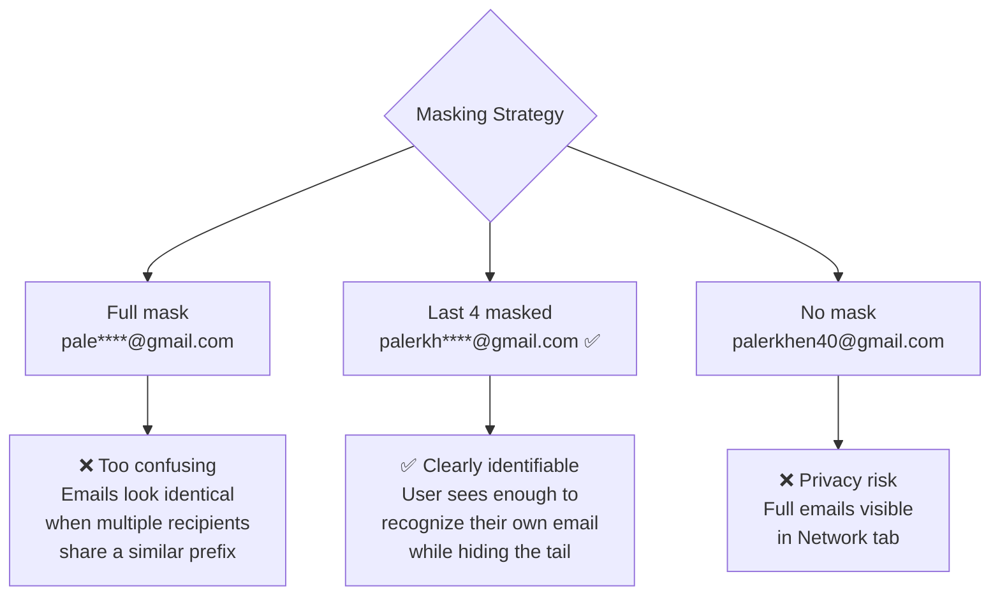
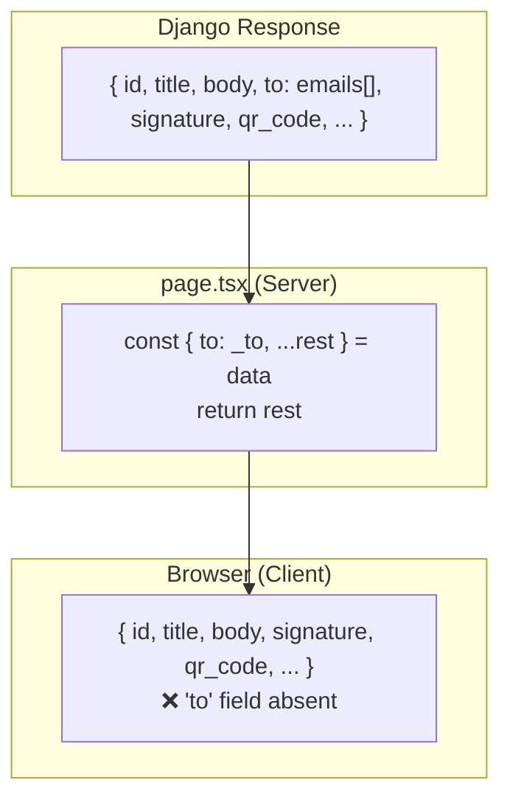
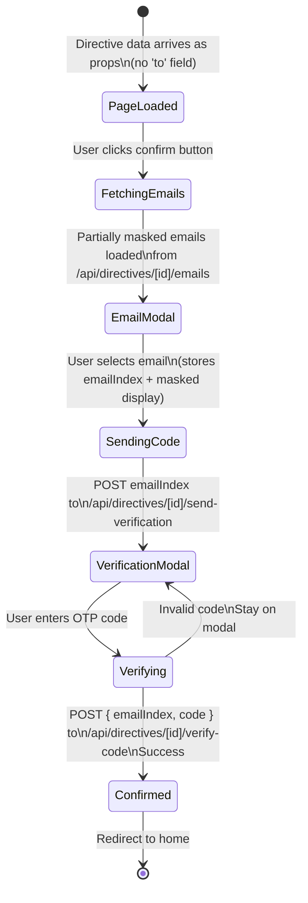
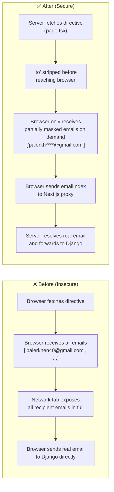

# Directive Email Privacy — Server-Side Implementation

## Overview

When a Memo/Policy (directive) is sent to multiple employees, the recipient email list (`to` field) was previously returned directly from Django to the browser. Any user inspecting the **Network tab** could see all recipient emails.

This document describes the server-side proxy architecture that hides real email addresses from the browser entirely.

---

## The Problem



---

## The Solution — Architecture Overview

```mermaid
flowchart TD
    A[User visits /directives/23] --> B[Next.js Server Component\npage.tsx]
    B --> C{Fetch directive\nfrom Django}
    C -->|Server-to-server| D[(Django API\n/api/directives/23/)]
    D -->|Full response with 'to' field| B
    B -->|Strip 'to' field| E[Pass sanitized directive\nto Content as props]
    E --> F[Browser renders page\nNO emails in response]

    F --> G[User clicks confirm button]
    G --> H[Client fetches\n/api/directives/23/emails]
    H --> I[Next.js Route Handler\nemails/route.ts]
    I -->|Server-to-server| D
    D -->|Full email list| I
    I -->|Last 4 chars masked\npalerkh****@gmail.com| H
    H --> J[EmailSelectionModal\nshows partially masked emails]

    J --> K[User picks email by index]
    K --> L[Client POSTs\n/api/directives/23/send-verification\n{ emailIndex: 0 }]
    L --> M[Next.js Route Handler\nsend-verification/route.ts]
    M -->|Resolve index → real email| D
    M -->|POST { email: real }| D
    D -->|Send OTP code| N[Employee's Inbox]
    M -->|Success response\nno email in body| L

    K --> O[User enters OTP code]
    O --> P[Client POSTs\n/api/directives/23/verify-code\n{ emailIndex: 0, code: 123456 }]
    P --> Q[Next.js Route Handler\nverify-code/route.ts]
    Q -->|Resolve index → real email| D
    Q -->|POST { email, code }| D
    D -->|Verified| Q
    Q -->|Success| P
```

---

## Request Flow — Sequence Diagram



---

## File Structure



---

## Email Masking Logic

The last 4 characters of the local part (before `@`) are always replaced with `****`. The rest of the email remains visible so users can clearly identify their own email.



### Examples

| Original | Masked |
|---|---|
| `palerkhen40@gmail.com` | `palerkh****@gmail.com` |
| `yahshua.palerkh@gmail.com` | `yahshua.pa****@gmail.com` |
| `bob123@company.com` | `bob1****@company.com` |

### Why This Masking Strategy

The target users of the Memo/Policy directive feature are **non-technical employees (boomers)**. The masking is designed with their UX in mind:



| Strategy | Identifiable | Private | UX for non-tech users |
|---|---|---|---|
| Full mask `pale****@gmail.com` | ❌ Ambiguous | ✅ | ❌ Confusing |
| Last 4 masked `palerkh****@gmail.com` | ✅ Clear | ✅ | ✅ Easy |
| No mask `palerkhen40@gmail.com` | ✅ Clear | ❌ | ✅ Easy |

---

## Data Stripping — What the Browser Sees



---

## State Flow in Content.tsx



---

## Key Types

```typescript
// types/directives.ts

interface MaskedEmail {
  index: number;  // Position in the real email array (server-side only)
  masked: string; // e.g. "palerkh****@gmail.com" — last 4 chars of local part hidden
}

interface SendVerificationRequest {
  emailIndex: number; // Index only — real email never sent from browser
}

interface VerifyDirectiveParams {
  directiveId: number;
  emailIndex: number; // Index only — real email never sent from browser
  code: string;
}
```

---

## Security Comparison



---

## Environment Variables

Both servers must share the same `INTERNAL_API_SECRET` value so Next.js API routes can authenticate their server-to-server calls to Django.

| Variable | Backend `.env` | Frontend `.env` |
|---|---|---|
| `INTERNAL_API_SECRET` | ✅ Required | ✅ Required |

Generate a secret: `openssl rand -hex 32`

---

## Related Files

| File | Type | Role |
|---|---|---|
| `app/(un-auth)/directives/[id]/page.tsx` | Server Component | Initial fetch, strips `to` field |
| `app/api/directives/[id]/emails/route.ts` | API Route | Returns partially masked email list |
| `app/api/directives/[id]/send-verification/route.ts` | API Route | Proxy — resolves index, sends OTP |
| `app/api/directives/[id]/verify-code/route.ts` | API Route | Proxy — resolves index, verifies OTP |
| `components/pages/(un-auth)/directives/Content.tsx` | Client Component | Main UI, index-based flow |
| `components/pages/(un-auth)/directives/modals/EmailSelectionModal.tsx` | Client Component | Partially masked email dropdown |
| `components/pages/(un-auth)/directives/hooks/useSendVerification.ts` | Hook | Sends `emailIndex` to proxy |
| `components/pages/(un-auth)/directives/hooks/useVerifyDirective.ts` | Hook | Sends `emailIndex + code` to proxy |
| `types/directives.ts` | Types | `MaskedEmail`, updated request types |
| `root/settings.py` | Django Config | `INTERNAL_API_SECRET` setting |
