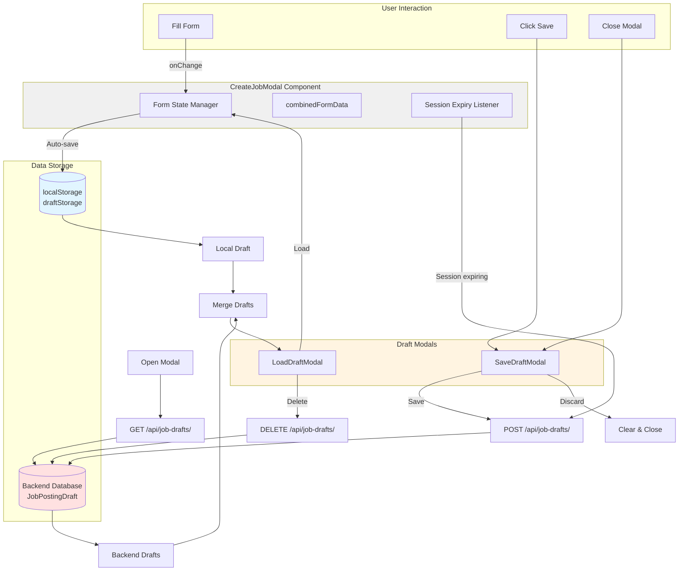
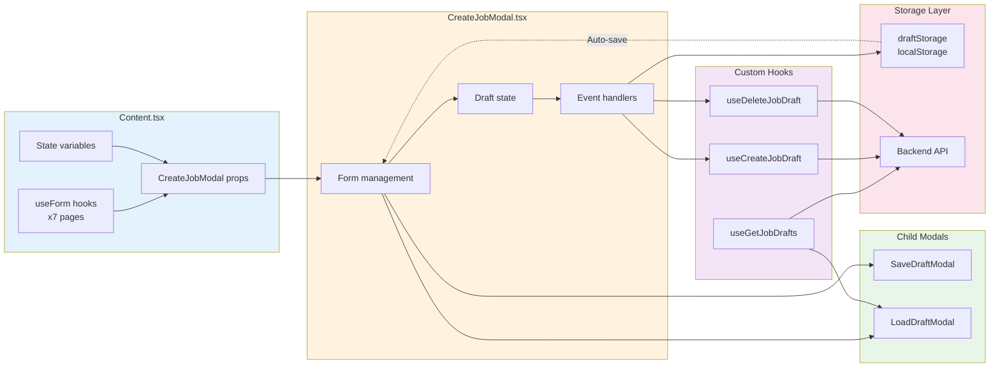
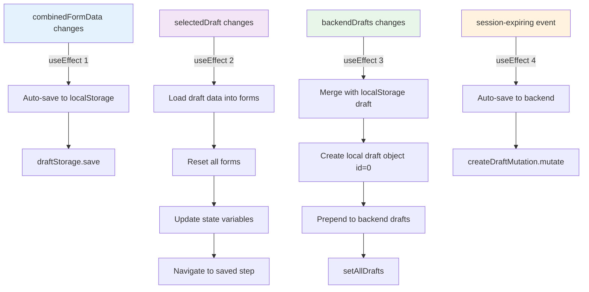
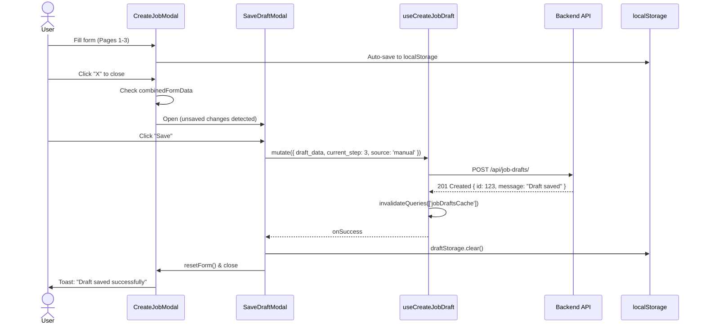
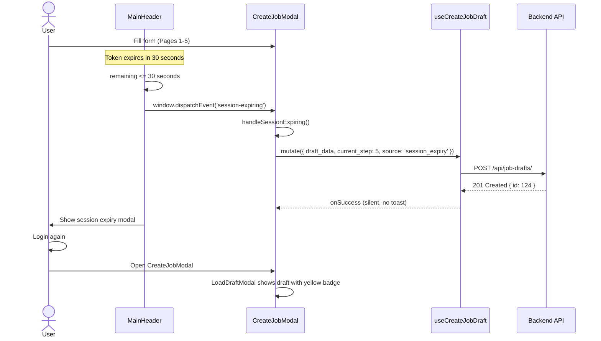
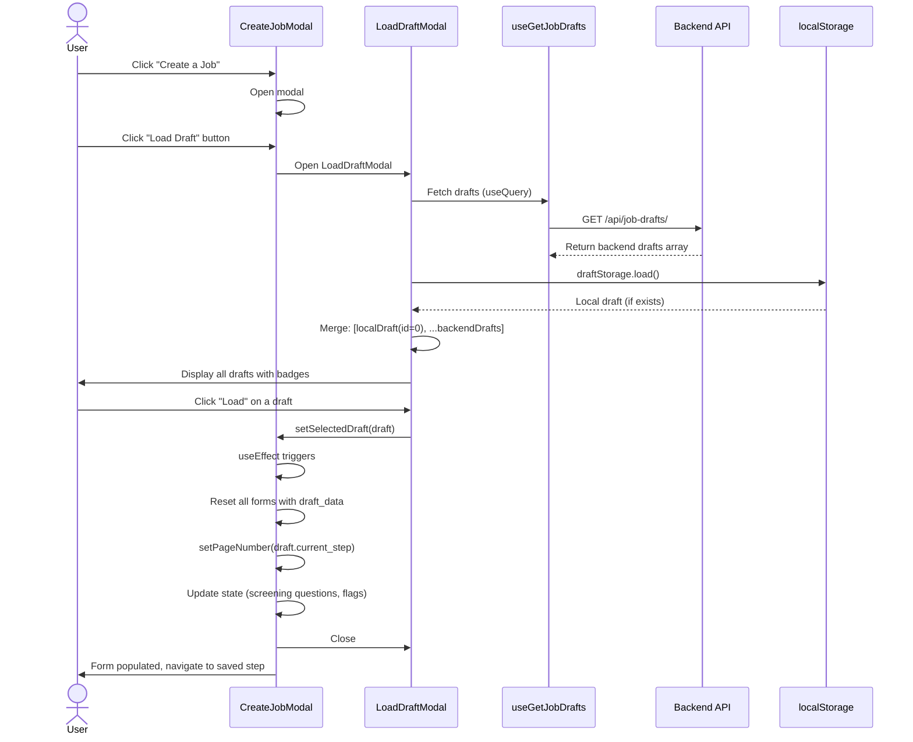
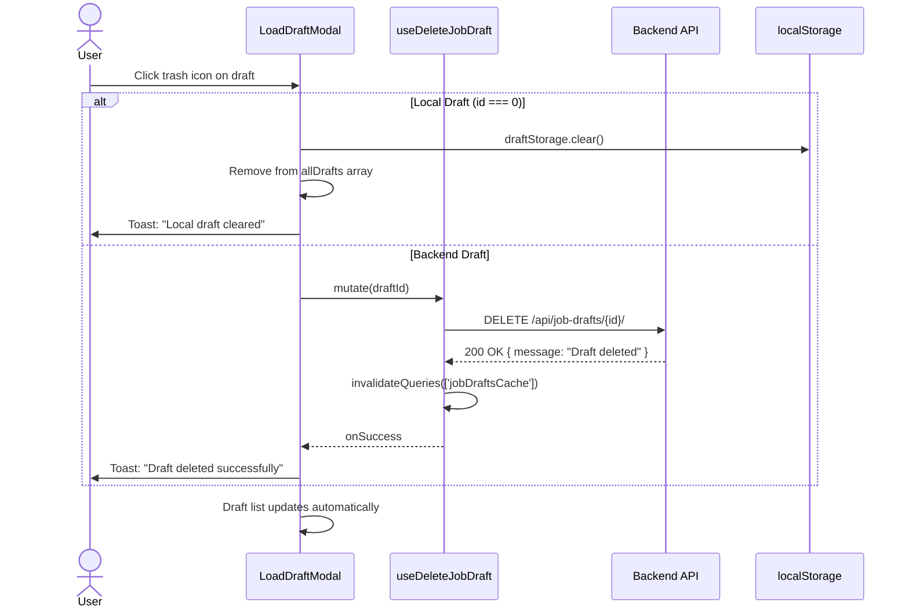
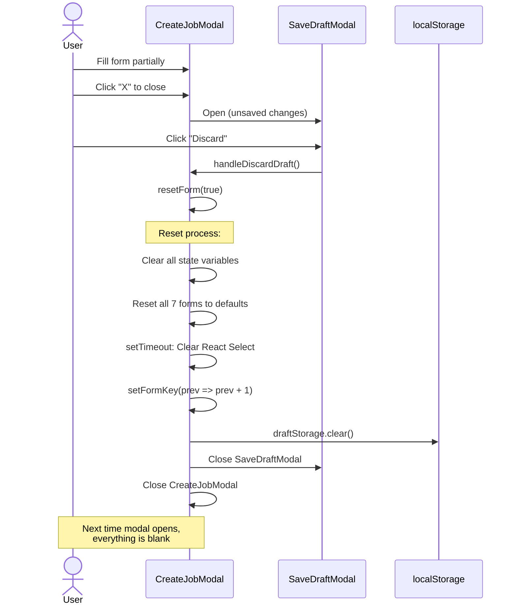

# Job Posting Draft Feature - Frontend Documentation

## Table of Contents
- [Overview](#overview)
- [Architecture](#architecture)
- [Type Definitions](#type-definitions)
- [Custom Hooks](#custom-hooks)
- [Components](#components)
- [Local Storage](#local-storage)
- [State Management](#state-management)
- [User Flows](#user-flows)
- [Testing](#testing)

---

## Overview

The Job Posting Draft feature allows users to save incomplete job postings and resume them later. This prevents data loss and improves user experience during the multi-step job posting creation process.

### Key Features

1. **Auto-save to localStorage** - Form data automatically saves to browser localStorage as users progress
2. **Manual draft saving** - Users can manually save drafts to the database
3. **Session expiry auto-save** - Drafts automatically save to database when session is about to expire
4. **Draft management** - Load, view, and delete saved drafts
5. **Local + Server drafts** - Combines localStorage drafts with server-saved drafts
6. **Multi-step form state** - Preserves form progress across all 8 steps

---

## Architecture

### Data Flow Diagram



### Component Interaction



### Storage Strategy

1. **Primary Storage (localStorage)**
   - Automatically saves on every form change
   - Persists across page refreshes
   - Fast, no network latency
   - Limited to current browser

2. **Secondary Storage (Database)**
   - Manual saves by user
   - Auto-saves on session expiry
   - Accessible across devices
   - Permanent storage

---

## Type Definitions

**Location:** `src/types/job_posting_draft.ts`

### T_JobPostingDraftData

Represents the form data stored in a draft. Organized by page number.

```typescript
export interface T_JobPostingDraftData {
  // Page 1: Basic Info
  country?: string;
  language?: string;

  // Page 2: Job Details
  jobTitle?: string;
  position?: string;
  positionDescription?: string;
  advertiseTo?: string;
  placeAdvertise?: string;      // Alias for advertiseTo
  jobType?: string;
  workSetup?: string;
  jobSchedule?: string;
  schedule?: string;             // Alias for jobSchedule
  requiredSlot?: string;
  hireCount?: string;            // Alias for requiredSlot
  dateRequired?: string;
  hireDate?: string | Date;      // Alias for dateRequired

  // Page 3: Salary & Benefits
  salaryRangeType?: string;
  rate?: string;
  minimumAmount?: string;
  maximumAmount?: string;
  exactAmount?: string;
  offeredBenefits?: string;
  isShowSalary?: boolean;
  isShowBenefits?: boolean;
  salary?: {
    salaryType?: string;
    rate?: string;
    minimumAmount?: string;
    maximumAmount?: string;
    exactAmount?: string;
    offeredBenefits?: string;
    isShowSalary?: boolean;
    isShowBenefits?: boolean;
  };

  // Page 4: Job Description
  jobDescription?: string;
  qualifications?: string;
  jobRemark?: string;
  notesRemarks?: string;         // Alias for jobRemark
  jobUrl?: string;
  uploadedJobDescription?: File | null;
  isShowRoles?: boolean;
  isShowRemarks?: boolean;

  // Page 5: Poster Settings
  posterType?: string;
  uploadedCustomPoster?: File | null;
  ogUrl?: string;
  ogType?: string;
  ogTitle?: string;
  ogDescription?: string;

  // Page 6: Share Settings
  sharedTo?: string;

  // Page 7: Screening Questions
  screeningQuestions?: any[];
  autoRejectEnabled?: boolean;
  rejectionFeedback?: string;
  isVideoIntroEnabled?: boolean;

  // Page 8: Job Stages
  jobStages?: any[];
}
```

**Design Notes:**
- Uses optional properties (`?`) for flexibility
- Includes field aliases (e.g., `placeAdvertise` and `advertiseTo`)
- Supports both nested objects (`salary`) and flat structure
- Files stored as `File | null` for form compatibility

---

### T_JobPostingDraft

Represents a complete draft object from the backend.

```typescript
export interface T_JobPostingDraft {
  id: number;
  draft_name: string | null;
  draft_data: T_JobPostingDraftData;
  current_step: number;
  source: 'manual' | 'session_expiry' | 'browser_close';
  job_title: string;
  position: string | null;
  uploaded_job_description: string | null;
  uploaded_custom_poster: string | null;
  created_at: string;
  updated_at: string;
}
```

---

### T_CreateJobDraftData

Request payload for creating a draft.

```typescript
export interface T_CreateJobDraftData {
  draft_name?: string;
  draft_data: T_JobPostingDraftData;
  current_step: number;
  source?: 'manual' | 'session_expiry' | 'browser_close';
  uploaded_job_description?: File;
  uploaded_custom_poster?: File;
}
```

---

### T_JobDraftResponse

API response format.

```typescript
export interface T_JobDraftResponse {
  message: string;
  id?: number;
}
```

---

## Custom Hooks

### useGetJobDrafts

**Location:** `src/components/pages/(auth)/employer/job-postings/post-job/hooks/useGetJobDrafts.ts`

**Purpose:** Fetch all drafts for the current user

**Implementation:**
```typescript
import { useQuery } from '@tanstack/react-query';
import { getCookie } from 'cookies-next';
import { T_JobPostingDraft } from '@/types/job_posting_draft';

async function getJobDrafts(): Promise<T_JobPostingDraft[]> {
  try {
    const token = getCookie('token');
    const config = {
      method: 'GET',
      headers: {
        'Content-Type': 'application/json',
        Authorization: `Token ${token}`,
      },
    };

    if (token) {
      const res = await fetch(`${process.env.NEXT_PUBLIC_API_URL}/api/job-drafts/`, config);
      if (!res.ok) {
        const errorData = await res.json();
        throw new Error(errorData.message || 'Failed to fetch drafts');
      }
      const data = await res.json();
      return Array.isArray(data) ? data : (data.data || []);
    }
    return [];
  } catch (error: any) {
    console.error('Error fetching drafts:', error);
    throw new Error(error.message || 'Failed to fetch drafts');
  }
}

function useGetJobDrafts() {
  const query = useQuery({
    queryKey: ['jobDraftsCache'],
    queryFn: () => getJobDrafts(),
    refetchOnWindowFocus: false,
  });
  return query;
}

export default useGetJobDrafts;
```

**Usage:**
```typescript
const { data: backendDrafts = [], isLoading: isDraftsLoading } = useGetJobDrafts();
```

**Returns:**
- `data` - Array of `T_JobPostingDraft[]`
- `isLoading` - Boolean loading state
- `error` - Error object if request fails
- `refetch` - Function to manually refetch

---

### useCreateJobDraft

**Location:** `src/components/pages/(auth)/employer/job-postings/post-job/hooks/useCreateJobDraft.ts`

**Purpose:** Create a new draft

**Implementation:**
```typescript
import { useMutation, useQueryClient } from '@tanstack/react-query';
import { getCookie } from 'cookies-next';
import { T_CreateJobDraftData, T_JobDraftResponse } from '@/types/job_posting_draft';

async function createJobDraft(data: T_CreateJobDraftData): Promise<T_JobDraftResponse> {
  const token = getCookie('token');

  const formData = new FormData();

  // Append draft_data as JSON string
  formData.append('draft_data', JSON.stringify(data.draft_data));
  formData.append('current_step', data.current_step.toString());

  if (data.draft_name) {
    formData.append('draft_name', data.draft_name);
  }

  if (data.source) {
    formData.append('source', data.source);
  }

  // Append files if present
  if (data.uploaded_job_description) {
    formData.append('uploaded_job_description', data.uploaded_job_description);
  }

  if (data.uploaded_custom_poster) {
    formData.append('uploaded_custom_poster', data.uploaded_custom_poster);
  }

  const config: RequestInit = {
    method: 'POST',
    headers: {
      Authorization: `Token ${token}`,
    },
    body: formData,
  };

  const url = `${process.env.NEXT_PUBLIC_API_URL}/api/job-drafts/`;

  const res = await fetch(url, config);
  if (!res.ok) {
    const errorData = await res.json();
    throw new Error(errorData.message || 'Failed to create draft');
  }

  const responseData = await res.json();
  return responseData.data || responseData;
}

export function useCreateJobDraft() {
  const queryClient = useQueryClient();

  return useMutation<T_JobDraftResponse, Error, T_CreateJobDraftData>({
    mutationFn: (data: T_CreateJobDraftData) => createJobDraft(data),
    onSuccess: () => {
      queryClient.invalidateQueries({ queryKey: ['jobDraftsCache'] });
    },
  });
}
```

**Usage:**
```typescript
const createDraftMutation = useCreateJobDraft();

// Create draft
createDraftMutation.mutate(
  {
    draft_data: combinedFormData,
    current_step: pageNumber,
    source: 'manual',
  },
  {
    onSuccess: (data) => {
      console.log('Draft saved:', data.id);
      toast.success('Draft saved successfully');
    },
    onError: (error) => {
      console.error('Failed:', error.message);
      toast.error(error.message);
    },
  }
);
```

**Important:**
- Uses `FormData` for file uploads
- `draft_data` is stringified as JSON
- Automatically invalidates query cache on success

---

### useDeleteJobDraft

**Location:** `src/components/pages/(auth)/employer/job-postings/post-job/hooks/useDeleteJobDraft.ts`

**Purpose:** Delete a draft

**Implementation:**
```typescript
import { useMutation, useQueryClient } from '@tanstack/react-query';
import { getCookie } from 'cookies-next';
import { T_JobDraftResponse } from '@/types/job_posting_draft';

async function deleteJobDraft(draftId: number): Promise<T_JobDraftResponse> {
  const token = getCookie('token');

  const config: RequestInit = {
    method: 'DELETE',
    headers: {
      'Content-Type': 'application/json',
      Authorization: `Token ${token}`,
    },
  };

  const url = `${process.env.NEXT_PUBLIC_API_URL}/api/job-drafts/${draftId}/`;

  const res = await fetch(url, config);
  if (!res.ok) {
    const errorData = await res.json();
    throw new Error(errorData.message || 'Failed to delete draft');
  }

  const responseData = await res.json();
  return responseData.data || responseData;
}

export function useDeleteJobDraft() {
  const queryClient = useQueryClient();

  return useMutation<T_JobDraftResponse, Error, number>({
    mutationFn: (draftId: number) => deleteJobDraft(draftId),
    onSuccess: () => {
      queryClient.invalidateQueries({ queryKey: ['jobDraftsCache'] });
    },
  });
}
```

**Usage:**
```typescript
const deleteDraftMutation = useDeleteJobDraft();

// Delete draft
deleteDraftMutation.mutate(draftId, {
  onSuccess: () => {
    toast.success('Draft deleted successfully');
  },
  onError: (error) => {
    toast.error(error.message);
  },
});
```

---

## Components

### SaveDraftModal

**Location:** `src/components/pages/(auth)/employer/job-postings/post-job/modals/SaveDraftModal.tsx`

**Purpose:** Prompt user to save/discard/cancel when closing with unsaved changes

**Props:**
```typescript
interface SaveDraftModalProps {
  isOpen: boolean;
  onClose: () => void;
  onSave: () => void;
  onDiscard: () => void;
  isSaving?: boolean;
}
```

**UI Elements:**
- **Warning Icon** - Red warning indicator
- **Message** - "You have unsaved changes. Would you like to save your progress as a draft?"
- **Buttons:**
  - **Discard** - Clear all forms and close modal
  - **Cancel** - Return to editing
  - **Save** - Save draft to database (shows "Saving..." when loading)

**Usage:**
```typescript
<SaveDraftModal
  isOpen={isSaveDraftModalOpen}
  onClose={() => setIsSaveDraftModalOpen(false)}
  onSave={handleSaveDraft}
  onDiscard={handleDiscardDraft}
  isSaving={createDraftMutation.isLoading}
/>
```

**Styling:**
- z-index: `60` (higher than parent modal)
- Responsive width: full on mobile, 500px on desktop
- Custom warning icon from `@/svg/WarningRed`

---

### LoadDraftModal

**Location:** `src/components/pages/(auth)/employer/job-postings/post-job/modals/LoadDraftModal.tsx`

**Purpose:** Display list of saved drafts for user to load

**Props:**
```typescript
interface LoadDraftModalProps {
  isOpen: boolean;
  onClose: () => void;
  drafts: T_JobPostingDraft[];
  onLoadDraft: (draft: T_JobPostingDraft) => void;
  onDeleteDraft: (draftId: number) => void;
  isLoading?: boolean;
  isDeleting?: boolean;
}
```

**UI Elements:**

Each draft card shows:
- **Job Title** - From `draft.job_title`
- **Progress** - "Step X of 8"
- **Last Updated** - Relative time using `date-fns` (e.g., "5 minutes ago")
- **Source Badge:**
  - Yellow badge for `source === 'session_expiry'` - "Saved from session expiry"
  - Orange badge for `id === 0` - "Local Draft (Not synced to server)"
- **Actions:**
  - **Load Button** - Blue button to load draft
  - **Delete Button** - Red trash icon button

**States:**

1. **Loading State**
   ```typescript
   {isLoading ? (
     <div className="flex justify-center py-8">
       <div className="animate-spin rounded-full h-8 w-8 border-b-2 border-savoy-blue"></div>
     </div>
   ) : ...}
   ```

2. **Empty State**
   ```typescript
   {drafts.length === 0 ? (
     <div className="text-center py-8">
       <p className="text-gray-500">No drafts found</p>
     </div>
   ) : ...}
   ```

3. **Draft List**
   - Max height: `max-h-96` with scroll
   - Hover effect: border changes to `border-savoy-blue`

**Usage:**
```typescript
<LoadDraftModal
  isOpen={isLoadDraftModalOpen}
  onClose={() => setIsLoadDraftModalOpen(false)}
  drafts={allDrafts}
  onLoadDraft={handleLoadDraftClick}
  onDeleteDraft={handleDeleteDraft}
  isLoading={isDraftsLoading}
  isDeleting={deleteDraftMutation.isLoading}
/>
```

**Styling:**
- z-index: `50`
- Blue header with `bg-savoy-blue`
- Responsive max-width: `sm:max-w-2xl`

---

## Local Storage

**Location:** `src/helpers/draftStorage.ts`

**Purpose:** Manage draft data in browser localStorage

### Storage Keys

```typescript
const DRAFT_STORAGE_KEY = 'job_posting_draft';
const DRAFT_TIMESTAMP_KEY = 'job_posting_draft_timestamp';
const DRAFT_STEP_KEY = 'job_posting_draft_step';
```

### API Methods

#### save(data, currentStep)

Saves draft data to localStorage.

```typescript
draftStorage.save(combinedFormData, pageNumber);
```

**Parameters:**
- `data: T_JobPostingDraftData` - Form data to save
- `currentStep: number` - Current page number (1-8)

**Stored Data:**
```typescript
localStorage.setItem('job_posting_draft', JSON.stringify(data));
localStorage.setItem('job_posting_draft_step', currentStep.toString());
localStorage.setItem('job_posting_draft_timestamp', Date.now().toString());
```

---

#### load()

Loads draft data from localStorage.

```typescript
const draft = draftStorage.load();
if (draft) {
  console.log('Draft data:', draft.data);
  console.log('Current step:', draft.step);
  console.log('Saved at:', new Date(draft.timestamp));
}
```

**Returns:**
```typescript
{
  data: T_JobPostingDraftData,
  step: number,
  timestamp: number
} | null
```

Returns `null` if no draft exists or parsing fails.

---

#### clear()

Removes all draft data from localStorage.

```typescript
draftStorage.clear();
```

**Clears:**
- `job_posting_draft`
- `job_posting_draft_step`
- `job_posting_draft_timestamp`

---

#### exists()

Checks if draft exists in localStorage.

```typescript
if (draftStorage.exists()) {
  console.log('Draft found in localStorage');
}
```

**Returns:** `boolean`

---

#### getAge()

Returns draft age in milliseconds.

```typescript
const age = draftStorage.getAge();
if (age && age > 24 * 60 * 60 * 1000) {
  console.log('Draft is older than 24 hours');
}
```

**Returns:** `number | null`

**Example calculation:**
```typescript
const ageInHours = age / (1000 * 60 * 60);
const ageInDays = age / (1000 * 60 * 60 * 24);
```

---

### Error Handling

All methods are wrapped in try-catch blocks:

```typescript
try {
  localStorage.setItem(key, value);
} catch (error) {
  console.error('Failed to save to localStorage:', error);
}
```

**Common Errors:**
- QuotaExceededError - localStorage is full
- SecurityError - localStorage access denied (private browsing)

---

## State Management

### CreateJobModal State

**Location:** `src/components/pages/(auth)/employer/job-postings/post-job/modals/CreateJobModal.tsx`

#### Draft-related State

```typescript
// Draft management state
const [isSaveDraftModalOpen, setIsSaveDraftModalOpen] = useState(false);
const [isLoadDraftModalOpen, setIsLoadDraftModalOpen] = useState(false);
const [selectedDraft, setSelectedDraft] = useState<T_JobPostingDraft | null>(null);
const [allDrafts, setAllDrafts] = useState<T_JobPostingDraft[]>([]);
const [formKey, setFormKey] = useState(0);
```

| Variable | Type | Purpose |
|----------|------|---------|
| `isSaveDraftModalOpen` | boolean | Controls SaveDraftModal visibility |
| `isLoadDraftModalOpen` | boolean | Controls LoadDraftModal visibility |
| `selectedDraft` | T_JobPostingDraft \| null | Currently loaded draft |
| `allDrafts` | T_JobPostingDraft[] | Combined list (localStorage + backend) |
| `formKey` | number | Forces form remount on clear (for React Select) |

---

### State Management Flow



### useEffect Hooks

#### 1. Auto-save to localStorage

```typescript
useEffect(() => {
  if (isOpen && Object.keys(combinedFormData).length > 0) {
    draftStorage.save(combinedFormData, pageNumber);
  }
}, [combinedFormData, pageNumber, isOpen]);
```

**Triggers:** Every time `combinedFormData` or `pageNumber` changes

**Purpose:** Automatically save form progress to localStorage

---

#### 2. Session expiry listener

```typescript
useEffect(() => {
  const handleSessionExpiring = () => {
    if (Object.keys(combinedFormData).length > 0) {
      createDraftMutation.mutate({
        draft_data: combinedFormData,
        current_step: pageNumber,
        source: 'session_expiry',
      });
    }
  };

  window.addEventListener('session-expiring', handleSessionExpiring);
  return () => window.removeEventListener('session-expiring', handleSessionExpiring);
}, [combinedFormData, pageNumber]);
```

**Event Source:** `MainHeader.tsx` dispatches event 30 seconds before token expiration

**Purpose:** Auto-save draft to database before session expires

---

#### 3. Merge localStorage + backend drafts

```typescript
useEffect(() => {
  const localDraft = draftStorage.load();
  const combinedDrafts = [...backendDrafts];

  if (localDraft && localDraft.data && Object.keys(localDraft.data).length > 0) {
    const localDraftObject: T_JobPostingDraft = {
      id: 0, // Indicates local draft
      draft_name: 'Local Draft (Not Synced)',
      draft_data: localDraft.data,
      current_step: localDraft.step || 1,
      source: 'browser_close',
      job_title: localDraft.data.jobTitle || 'Untitled Job',
      position: localDraft.data.position || null,
      uploaded_job_description: null,
      uploaded_custom_poster: null,
      created_at: localDraft.timestamp ? new Date(localDraft.timestamp).toISOString() : new Date().toISOString(),
      updated_at: localDraft.timestamp ? new Date(localDraft.timestamp).toISOString() : new Date().toISOString(),
    };

    combinedDrafts.unshift(localDraftObject); // Add at beginning
  }

  setAllDrafts(combinedDrafts);
}, [backendDrafts]);
```

**Purpose:** Create unified draft list with localStorage draft at top

**Key:** `id: 0` identifies localStorage draft

---

#### 4. Load draft data

```typescript
useEffect(() => {
  if (selectedDraft && isOpen) {
    const draftData = selectedDraft.draft_data;

    // Reset all forms with draft data
    firstForm.reset({
      country: draftData.country || 'Philippines',
      language: draftData.language || 'English',
      jobTitle: draftData.jobTitle || '',
      position: draftData.position || '',
      placeAdvertise: draftData.placeAdvertise || draftData.advertiseTo || '',
    });

    // Convert hireDate string to Date object
    let hireDateValue: Date | null = null;
    if (draftData.hireDate || draftData.dateRequired) {
      const dateStr = draftData.hireDate || draftData.dateRequired;
      try {
        hireDateValue = dateStr ? new Date(dateStr) : null;
      } catch (e) {
        console.error('Error parsing hireDate:', e);
      }
    }

    secondForm.reset({
      jobType: draftData.jobType || '',
      workSetup: draftData.workSetup || '',
      schedule: draftData.schedule || draftData.jobSchedule || '',
      hireCount: draftData.hireCount || draftData.requiredSlot || '',
      hireDate: hireDateValue,
    });

    // ... reset other forms ...

    // Update state
    setCombinedFormData(draftData);
    setPageNumber(selectedDraft.current_step);
    setScreeningQuestions(draftData.screeningQuestions || []);
    setAutoRejectEnabled(draftData.autoRejectEnabled || false);
    setIsVideoIntroEnabled(draftData.isVideoIntroEnabled || false);

    if (draftData.salaryRangeType || draftData.salary) {
      setIsRangeBenefitsAdded(true);
    }
  }
}, [selectedDraft, isOpen]);
```

**Triggers:** When `selectedDraft` changes (user clicks "Load")

**Purpose:** Populate all 8 forms with draft data

**Important Handling:**
- Field aliases (e.g., `placeAdvertise` vs `advertiseTo`)
- Date conversion (string to Date object)
- Salary nested object vs flat structure
- State updates (screening questions, flags)

---

### Handler Functions

#### handleSaveDraft()

Saves current form data to database.

```typescript
const handleSaveDraft = () => {
  createDraftMutation.mutate(
    {
      draft_data: combinedFormData,
      current_step: pageNumber,
      source: 'manual',
    },
    {
      onSuccess: () => {
        toast.custom(() => <CustomToast message="Draft saved successfully" type="success" />);
        setIsSaveDraftModalOpen(false);
        draftStorage.clear(); // Clear localStorage
        resetForm(); // Reset and close modal
      },
      onError: (error: any) => {
        toast.custom(() => <CustomToast message={error.message} type="error" />);
      },
    }
  );
};
```

**Flow:**
1. Call API to save draft
2. Show success toast
3. Close SaveDraftModal
4. Clear localStorage (now saved to server)
5. Reset form and close main modal

---

#### handleDiscardDraft()

Clears all forms and closes modal.

```typescript
const handleDiscardDraft = () => {
  setIsSaveDraftModalOpen(false);
  resetForm(true); // Reset with closeModal=true
};
```

**Flow:**
1. Close SaveDraftModal
2. Reset all forms
3. Clear localStorage
4. Close main modal

---

#### handleLoadDraftClick()

Loads selected draft into form.

```typescript
const handleLoadDraftClick = (draft: T_JobPostingDraft) => {
  setSelectedDraft(draft); // Triggers useEffect to populate forms
  setIsLoadDraftModalOpen(false);
};
```

**Flow:**
1. Set selectedDraft state
2. useEffect detects change and populates forms
3. Close LoadDraftModal
4. User continues editing

---

#### handleDeleteDraft()

Deletes draft (localStorage or backend).

```typescript
const handleDeleteDraft = (draftId: number) => {
  // Handle local draft (id === 0)
  if (draftId === 0) {
    draftStorage.clear();
    setAllDrafts(allDrafts.filter(draft => draft.id !== 0));
    toast.custom(() => <CustomToast message="Local draft cleared" type="success" />);
    return;
  }

  // Handle backend draft
  deleteDraftMutation.mutate(draftId, {
    onSuccess: () => {
      toast.custom(() => <CustomToast message="Draft deleted" type="success" />);
    },
    onError: (error: any) => {
      toast.custom(() => <CustomToast message={error.message} type="error" />);
    },
  });
};
```

**Logic:**
- If `id === 0`: Clear localStorage and update UI
- Otherwise: Call API to delete from database

---

#### resetForm()

Clears all form data and state.

```typescript
const resetForm = (closeModal: boolean = true) => {
  // Clear state
  setSelectedDraft(null);
  setCombinedFormData({});
  draftStorage.clear();
  setPageNumber(1);
  setIsRangeBenefitsAdded(false);
  setScreeningQuestions([]);
  setAutoRejectEnabled(true);
  setIsVideoIntroEnabled(false);
  setFileProps({});

  // Reset all forms to default values
  firstForm.reset();
  secondForm.reset();
  thirdForm.reset();
  fourthForm.reset();
  fifthForm.reset();
  sixthForm.reset();
  seventhForm.reset();

  // Force React Select clearing
  setTimeout(() => {
    firstForm.resetField('position', { defaultValue: '' });
    firstForm.setValue('position', '', { shouldValidate: false, shouldDirty: false });
    firstForm.resetField('placeAdvertise', { defaultValue: [] });
    firstForm.setValue('placeAdvertise', [], { shouldValidate: false, shouldDirty: false });
  }, 0);

  // Force remount
  setFormKey(prev => prev + 1);

  // Close modal if requested
  if (closeModal) {
    setIsOpen(false);
  }
};
```

**Key Features:**
- Clears all state variables
- Resets all React Hook Form instances
- Special handling for React Select (setTimeout + formKey)
- Optional modal closing

---

## User Flows

### Flow 1: Manual Draft Save



---

### Flow 2: Auto-save on Session Expiry



---

### Flow 3: Load Draft



---

### Flow 4: Delete Draft



---

### Flow 5: Discard Changes



---

## Testing

### Test Files (To Be Created)

- `src/components/pages/(auth)/employer/job-postings/post-job/hooks/__tests__/useGetJobDrafts.test.ts`
- `src/components/pages/(auth)/employer/job-postings/post-job/hooks/__tests__/useCreateJobDraft.test.ts`
- `src/components/pages/(auth)/employer/job-postings/post-job/hooks/__tests__/useDeleteJobDraft.test.ts`
- `src/helpers/__tests__/draftStorage.test.ts`
- `src/components/pages/(auth)/employer/job-postings/post-job/modals/__tests__/SaveDraftModal.test.tsx`
- `src/components/pages/(auth)/employer/job-postings/post-job/modals/__tests__/LoadDraftModal.test.tsx`

---

### Test Examples

#### draftStorage Tests

```typescript
import { draftStorage } from '@/helpers/draftStorage';

describe('draftStorage', () => {
  beforeEach(() => {
    localStorage.clear();
  });

  it('should save draft to localStorage', () => {
    const data = { jobTitle: 'Software Engineer', country: 'Philippines' };
    draftStorage.save(data, 2);

    expect(localStorage.getItem('job_posting_draft')).toBeTruthy();
    expect(localStorage.getItem('job_posting_draft_step')).toBe('2');
    expect(localStorage.getItem('job_posting_draft_timestamp')).toBeTruthy();
  });

  it('should load draft from localStorage', () => {
    const data = { jobTitle: 'Software Engineer' };
    draftStorage.save(data, 3);

    const loaded = draftStorage.load();
    expect(loaded).not.toBeNull();
    expect(loaded!.data.jobTitle).toBe('Software Engineer');
    expect(loaded!.step).toBe(3);
    expect(loaded!.timestamp).toBeGreaterThan(0);
  });

  it('should clear draft from localStorage', () => {
    draftStorage.save({ jobTitle: 'Test' }, 1);
    draftStorage.clear();

    expect(draftStorage.load()).toBeNull();
    expect(localStorage.getItem('job_posting_draft')).toBeNull();
  });

  it('should return draft age in milliseconds', () => {
    draftStorage.save({ jobTitle: 'Test' }, 1);
    const age = draftStorage.getAge();

    expect(age).toBeGreaterThanOrEqual(0);
    expect(age).toBeLessThan(1000); // Less than 1 second old
  });

  it('should return true when draft exists', () => {
    draftStorage.save({ jobTitle: 'Test' }, 1);
    expect(draftStorage.exists()).toBe(true);

    draftStorage.clear();
    expect(draftStorage.exists()).toBe(false);
  });
});
```

---

#### SaveDraftModal Tests

```typescript
import { render, screen, fireEvent } from '@testing-library/react';
import SaveDraftModal from '../SaveDraftModal';

describe('SaveDraftModal', () => {
  const defaultProps = {
    isOpen: true,
    onClose: jest.fn(),
    onSave: jest.fn(),
    onDiscard: jest.fn(),
    isSaving: false,
  };

  it('should render warning message', () => {
    render(<SaveDraftModal {...defaultProps} />);

    expect(screen.getByText(/unsaved changes/i)).toBeInTheDocument();
    expect(screen.getByText(/save your progress/i)).toBeInTheDocument();
  });

  it('should call onSave when Save button clicked', () => {
    const onSave = jest.fn();
    render(<SaveDraftModal {...defaultProps} onSave={onSave} />);

    fireEvent.click(screen.getByText('Save'));
    expect(onSave).toHaveBeenCalledTimes(1);
  });

  it('should call onDiscard when Discard button clicked', () => {
    const onDiscard = jest.fn();
    render(<SaveDraftModal {...defaultProps} onDiscard={onDiscard} />);

    fireEvent.click(screen.getByText('Discard'));
    expect(onDiscard).toHaveBeenCalledTimes(1);
  });

  it('should call onClose when Cancel button clicked', () => {
    const onClose = jest.fn();
    render(<SaveDraftModal {...defaultProps} onClose={onClose} />);

    fireEvent.click(screen.getByText('Cancel'));
    expect(onClose).toHaveBeenCalledTimes(1);
  });

  it('should show "Saving..." when isSaving is true', () => {
    render(<SaveDraftModal {...defaultProps} isSaving={true} />);

    expect(screen.getByText('Saving...')).toBeInTheDocument();
    expect(screen.getByText('Save')).toBeDisabled();
  });

  it('should disable buttons when isSaving is true', () => {
    render(<SaveDraftModal {...defaultProps} isSaving={true} />);

    expect(screen.getByText('Discard')).toBeDisabled();
    expect(screen.getByText('Cancel')).toBeDisabled();
    expect(screen.getByText('Saving...')).toBeDisabled();
  });
});
```

---

### Manual Testing Checklist

#### Auto-save to localStorage
- [ ] Fill form on Page 1
- [ ] Refresh page
- [ ] Open modal again
- [ ] Verify local draft appears in LoadDraftModal (with orange badge)
- [ ] Load local draft
- [ ] Verify all Page 1 data preserved

#### Manual Save
- [ ] Fill form across multiple pages
- [ ] Click "X" to close
- [ ] Click "Save" in SaveDraftModal
- [ ] Verify success toast
- [ ] Verify draft appears in backend (check database or API)
- [ ] Reload page and verify draft in LoadDraftModal

#### Session Expiry Auto-save
- [ ] Fill form
- [ ] Wait for session expiry warning (30 seconds before)
- [ ] Verify draft auto-saved (check network tab)
- [ ] Login again
- [ ] Verify draft in LoadDraftModal with yellow "session expiry" badge

#### Load Draft
- [ ] Open LoadDraftModal
- [ ] Verify drafts sorted by updated_at (newest first)
- [ ] Click "Load" on a draft
- [ ] Verify all form fields populated
- [ ] Verify correct page number
- [ ] Continue editing and save

#### Delete Draft
- [ ] Open LoadDraftModal
- [ ] Click trash icon on local draft (id=0)
- [ ] Verify "Local draft cleared" toast
- [ ] Verify draft removed from list
- [ ] Click trash icon on backend draft
- [ ] Verify "Draft deleted" toast
- [ ] Verify draft removed from database

#### Discard Changes
- [ ] Fill form
- [ ] Click "X"
- [ ] Click "Discard"
- [ ] Verify all forms cleared
- [ ] Verify localStorage cleared
- [ ] Verify modal closed
- [ ] Open modal again - verify blank form

#### React Select Clearing
- [ ] Load draft with position and placeAdvertise
- [ ] Click "X" → "Discard"
- [ ] Open modal again
- [ ] Verify Position shows "Select a position..." placeholder
- [ ] Verify placeAdvertise is empty

---

## Additional Features

### Session Expiry Integration

**Location:** `src/components/pages/(auth)/employer/MainHeader.tsx`

Added event dispatch before showing session expiry modal:

```typescript
// Show warning before expiration (30 seconds for 3-hour tokens)
if (remaining <= TOKEN_EXPIRATION_WARNING_SECONDS) {
  if (!isExpiring) {
    // Dispatch event for draft auto-save before showing modal
    window.dispatchEvent(new Event('session-expiring'));
  }
  setIsExpiring(true);
  setTimeRemaining(remaining);
}
```

**Integration with CreateJobModal:**
```typescript
useEffect(() => {
  const handleSessionExpiring = () => {
    if (Object.keys(combinedFormData).length > 0) {
      createDraftMutation.mutate({
        draft_data: combinedFormData,
        current_step: pageNumber,
        source: 'session_expiry',
      });
    }
  };

  window.addEventListener('session-expiring', handleSessionExpiring);
  return () => window.removeEventListener('session-expiring', handleSessionExpiring);
}, [combinedFormData, pageNumber]);
```

---

### Job URL Clearing Fix

**Location:** `src/components/pages/(auth)/employer/job-postings/job-posting-history/hooks/useUpdateJobPostItems.ts`

**Before:**
```typescript
// Only include job_url if user provided a value
if (jobPost.jobUrl) {
  formData.append('job_url', jobPost.jobUrl);
}
```

**After:**
```typescript
// Always include job_url for updates (even if empty) to allow clearing
if (jobPost.jobUrl !== undefined && jobPost.jobUrl !== null) {
  formData.append('job_url', jobPost.jobUrl);
}
```

**Impact:** Users can now clear the job URL field by setting it to an empty string. Previously, empty strings were skipped, preventing field clearing.

---

## Summary

This frontend documentation covers:

### Core Features
- ✅ TypeScript type definitions for all draft-related data
- ✅ Custom hooks (useGetJobDrafts, useCreateJobDraft, useDeleteJobDraft)
- ✅ Modal components (SaveDraftModal, LoadDraftModal)
- ✅ localStorage helper (draftStorage)
- ✅ Complete state management in CreateJobModal

### User Experience
- ✅ Auto-save to localStorage (no data loss on refresh)
- ✅ Manual save to database (accessible across devices)
- ✅ Session expiry auto-save (prevents data loss on timeout)
- ✅ Seamless draft load/delete
- ✅ Clear UI feedback with toasts and badges

### Integration
- ✅ Session expiry event handling
- ✅ Form remounting for React Select clearing
- ✅ Field alias support (flexible data structure)
- ✅ File upload support (job descriptions, posters)

**Last Updated:** February 17, 2026
