# Job Posting Update - Save Button on Each Page

## Overview

This feature allows users to save job posting updates from any page in the 8-page wizard modal, eliminating the need to navigate through all pages to save changes.

## Table of Contents

- [Before vs After Comparison](#before-vs-after-comparison)
- [Architecture Overview](#architecture-overview)
- [Data Flow](#data-flow)
- [Save Logic](#save-logic)
- [Button Layout](#button-layout)
- [Error Handling](#error-handling)
- [Implementation Details](#implementation-details)
- [Testing Guide](#testing-guide)

---

## Before vs After Comparison

### Old Structure (Before)

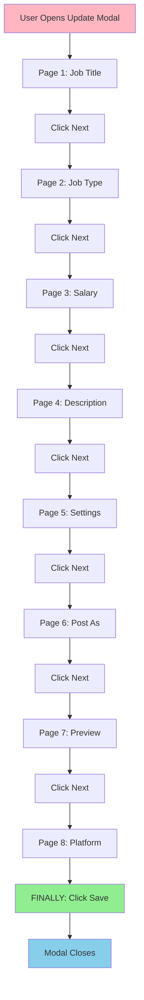

**Problems with Old Structure:**
- ❌ Must navigate through all 8 pages to save
- ❌ Cannot save quick edits on Page 1
- ❌ Time-consuming for minor updates
- ❌ Risk of losing changes if user accidentally closes modal

**User Flow Example:**
```
Scenario: Update job title on Page 1
1. Open modal → Page 1
2. Change job title
3. Click Next → Page 2
4. Click Next → Page 3
5. Click Next → Page 4
6. Click Next → Page 5
7. Click Next → Page 6
8. Click Next → Page 7
9. Click Next → Page 8
10. FINALLY click Save
11. Modal closes

Total clicks: 9 Next + 1 Save = 10 clicks
```

### New Structure (After)

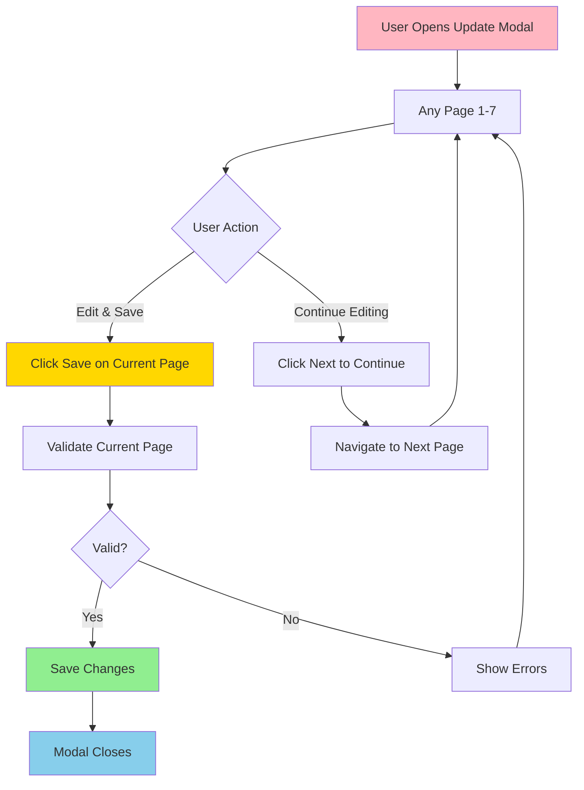

**Benefits of New Structure:**
- ✅ Save from any page (Pages 1-7)
- ✅ Quick edits without full navigation
- ✅ Validates only current page
- ✅ Preserves accumulated data
- ✅ Better user experience

**User Flow Example:**
```
Scenario: Update job title on Page 1
1. Open modal → Page 1
2. Change job title
3. Click Save
4. Modal closes

Total clicks: 1 Save = 1 click
```

### Feature Comparison Table

| Feature | Before | After |
|---------|--------|-------|
| **Save from Page 1** | ❌ No | ✅ Yes |
| **Save from Page 2** | ❌ No | ✅ Yes |
| **Save from Page 3** | ❌ No | ✅ Yes |
| **Save from Page 4** | ❌ No | ✅ Yes |
| **Save from Page 5** | ❌ No | ✅ Yes |
| **Save from Page 6** | ❌ No | ✅ Yes |
| **Save from Page 7** | ❌ No | ✅ Yes |
| **Save from Page 8** | ✅ Yes | ✅ Yes |
| **Validation** | All pages | Current page only |
| **Data Preservation** | All pages required | Accumulated + current |
| **Clicks for quick edit** | 10 clicks | 1 click |
| **Modal closure** | After Page 8 save | After any page save |

### UI Comparison

#### Before: Page 1 Footer

```
┌─────────────────────────────────────┐
│                                     │
│                    ┌──────────────┐ │
│                    │     Next     │ │
│                    └──────────────┘ │
│                                     │
└─────────────────────────────────────┘
```

**Only Next button available - cannot save**

#### After: Page 1 Footer

```
┌─────────────────────────────────────┐
│                                     │
│  ┌──────────┐  ┌──────────────┐    │
│  │   Save   │  │     Next     │    │
│  └──────────┘  └──────────────┘    │
│                                     │
└─────────────────────────────────────┘
```

**Save button added - can save immediately**

#### Before: Page 2 Footer

```
┌─────────────────────────────────────┐
│                                     │
│  ┌──────┐              ┌──────────┐│
│  │ Back │              │   Next   ││
│  └──────┘              └──────────┘│
│                                     │
└─────────────────────────────────────┘
```

**Back and Next only - cannot save**

#### After: Page 2 Footer

```
┌─────────────────────────────────────┐
│                                     │
│  ┌──────┐    ┌──────────┐  ┌──────┐│
│  │ Back │    │   Save   │  │ Next ││
│  └──────┘    └──────────┘  └──────┘│
│                                     │
└─────────────────────────────────────┘
```

**Save button added between actions**

### Code Structure Comparison

#### Before: Page Component Props

```typescript
// Pages 1-7 did not have save functionality
export default function CreateJobPageSalary({
  watch,
  setValue,
  register,
  setPageNumber,
  trigger,
  setFocus,
  getValues,
  onSubmit,
  pageNumber,
}: {
  watch: any;
  register: any;
  setValue: any;
  setPageNumber: Dispatch<number>;
  trigger: any;
  setFocus: any;
  getValues: any;
  onSubmit: () => void;
  pageNumber?: number;
}) {
  // Component logic
}
```

#### After: Page Component Props

```typescript
// Pages 1-7 now support save functionality
export default function CreateJobPageSalary({
  watch,
  setValue,
  register,
  setPageNumber,
  trigger,
  setFocus,
  getValues,
  onSubmit,
  pageNumber,
  isEdit,        // NEW
  onSave,        // NEW
  isLoading,     // NEW
}: {
  watch: any;
  register: any;
  setValue: any;
  setPageNumber: Dispatch<number>;
  trigger: any;
  setFocus: any;
  getValues: any;
  onSubmit: () => void;
  pageNumber?: number;
  isEdit?: boolean;        // NEW
  onSave?: () => void;     // NEW
  isLoading?: boolean;     // NEW
}) {
  // Component logic
}
```

### API Call Comparison

#### Before: Mutation Hook

```typescript
// All fields were required, even if empty
async function updateJobPost(jobPost: any, job_post_id: string) {
  const formData = new FormData();

  // Always appended, even if undefined
  formData.append('job_type', jobPost.jobType.join());  // ❌ Crashes if undefined
  formData.append('work_setup', jobPost.workSetup.join()); // ❌ Crashes if undefined
  formData.append('shared_to', '');  // ❌ Sends empty string

  const res = await fetch(`${API_URL}/api/jobs/${job_post_id}/`, {
    method: 'PATCH',
    body: formData,
  });

  return res.json();
}
```

#### After: Mutation Hook

```typescript
// Fields are optional with defensive checks
async function updateJobPost(jobPost: any, job_post_id: string) {
  const formData = new FormData();

  // Only append if field exists (proper PATCH)
  if (jobPost.jobType && Array.isArray(jobPost.jobType)) {
    formData.append('job_type', jobPost.jobType.join());  // ✅ Safe
  }

  if (jobPost.workSetup && Array.isArray(jobPost.workSetup)) {
    formData.append('work_setup', jobPost.workSetup.join());  // ✅ Safe
  }

  // Only send if has value
  if (jobPost.shared_to && Array.isArray(jobPost.shared_to) && jobPost.shared_to.length > 0) {
    formData.append('shared_to', jobPost.shared_to.join());  // ✅ Safe
  }

  const res = await fetch(`${API_URL}/api/jobs/${job_post_id}/`, {
    method: 'PATCH',
    body: formData,
  });

  return res.json();
}
```

### Data Flow Comparison

#### Before: Sequential Navigation Required

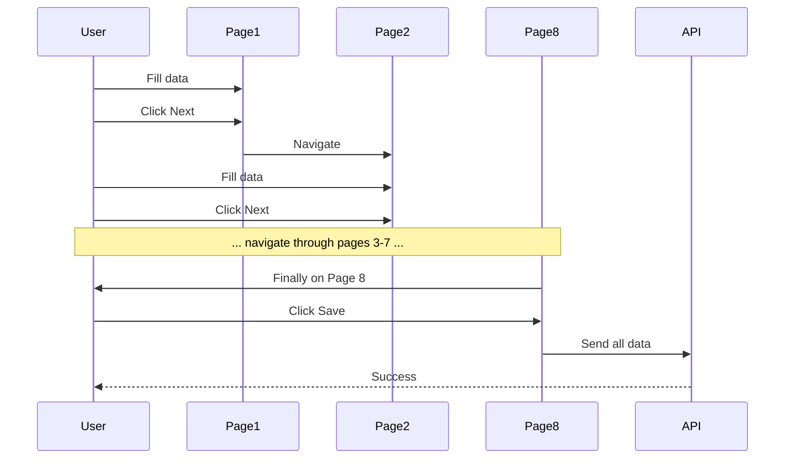

#### After: Save from Any Page

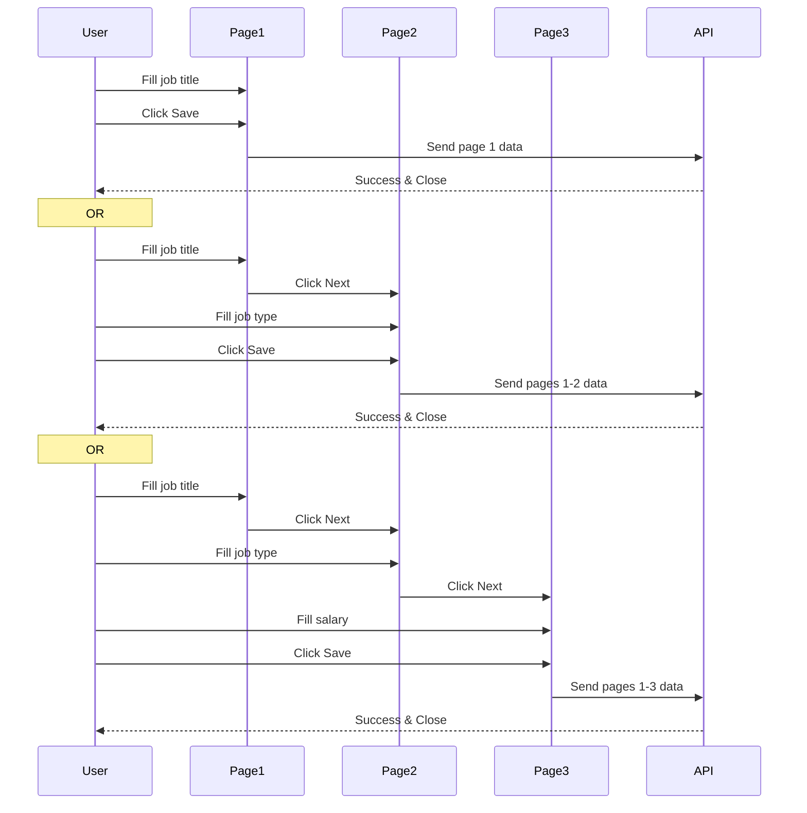

---

## Architecture Overview

### Component Structure

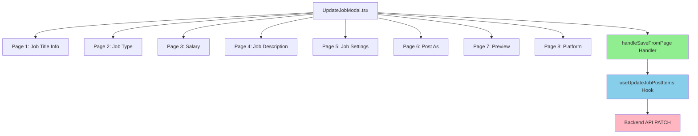

### Page Components

Each page component receives three new props when in edit mode:

| Prop | Type | Description |
|------|------|-------------|
| `isEdit` | `boolean` | Flag indicating if modal is in edit mode |
| `onSave` | `() => void` | Callback function to trigger save |
| `isLoading` | `boolean` | Loading state from mutation hook |

---

## Data Flow

### Accumulated Data Pattern

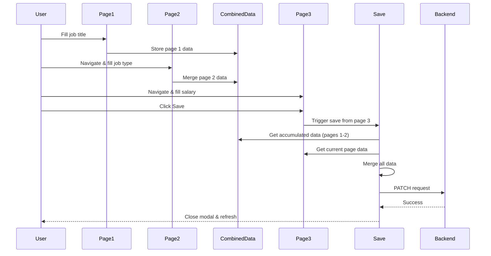

### Data Accumulation Logic

```typescript
// UpdateJobModal.tsx
const [combinedFormData, setCombinedFormData] = useState({});

// When user clicks Next on any page
const firstFormSubmit = (data: any) => {
  setCombinedFormData((prev) => ({ ...prev, ...data }));
  setPageNumber(2);
};

// When user clicks Save on page 3
handleSaveFromPage(3, thirdForm);
// Merges: combinedFormData (pages 1-2) + current page 3 data
```

---

## Save Logic

### Save Handler Flow

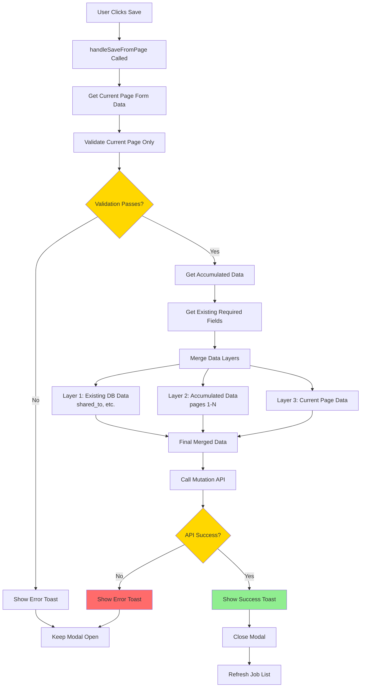

### Save Handler Implementation

```typescript
const handleSaveFromPage = (currentPageNumber: number, currentPageForm: any) => {
  // Step 1: Validate current page only
  currentPageForm.handleSubmit(
    (validData: any) => {
      // Step 2: Process page-specific data
      let processedData = { ...validData };

      if (currentPageNumber === 1) {
        // Add position description for page 1
        const selectedPosition = positionData?.find(
          (pos: any) => pos.id === validData.position
        );
        if (selectedPosition?.description) {
          processedData.positionDescription = selectedPosition.description;
        }
      }

      if (currentPageNumber === 5) {
        // Include screening questions for page 5
        processedData.screeningQuestions = screeningQuestions;
        processedData.autoRejectEnabled = autoRejectEnabled;
      }

      // Step 3: Preserve existing required fields from database
      const existingData: any = {};
      if (jobPostDataDetails?.shared_to) {
        existingData.shared_to = jobPostDataDetails.shared_to.split(',');
      }

      // Step 4: Merge data (existing → accumulated → current)
      const finalData = {
        ...existingData,        // Layer 1: DB data
        ...combinedFormData,    // Layer 2: Accumulated
        ...processedData        // Layer 3: Current page
      };

      // Step 5: Call API mutation
      mutate(
        {jobPost: finalData, job_post_id: isOpen.id},
        callbackReq
      );
    },
    (errors: any) => {
      // Validation failed
      toast.custom(() => (
        <CustomToast
          message="Please fix the errors on this page"
          type='error'
        />
      ));
    }
  )();
};
```

---

## Button Layout

### Visual Layout

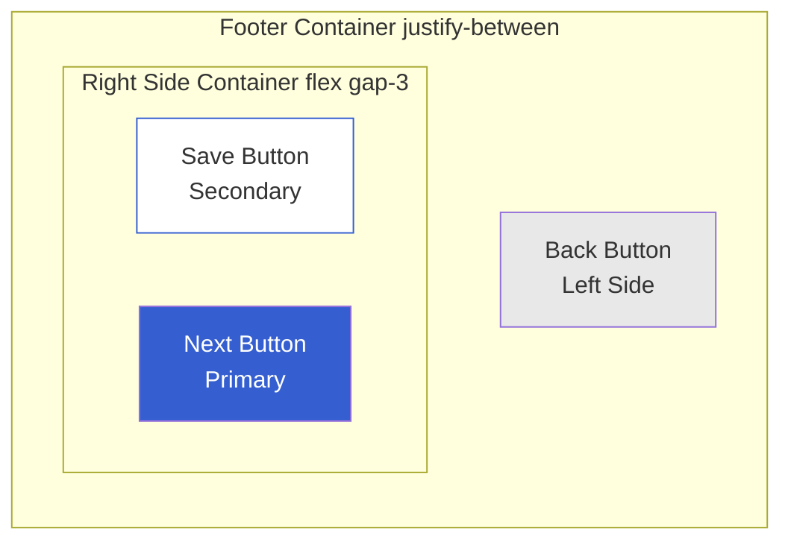

### Page 1 (No Back Button)

```
┌─────────────────────────────────────┐
│                                     │
│  ┌──────────┐  ┌──────────────┐    │
│  │   Save   │  │     Next     │    │
│  └──────────┘  └──────────────┘    │
│                                     │
└─────────────────────────────────────┘
```

### Pages 2-7 (With Back Button)

```
┌─────────────────────────────────────┐
│                                     │
│  ┌──────┐    ┌──────────┐  ┌──────┐│
│  │ Back │    │   Save   │  │ Next ││
│  └──────┘    └──────────┘  └──────┘│
│                                     │
└─────────────────────────────────────┘
```

### HTML Structure

```html
<!-- Pages 2-7 with Back button -->
<div className='mt-5 sm:mt-4 sm:flex justify-between px-4'>
  <!-- Left Side: Back Button -->
  <button id='pageBackBtn'>Back</button>

  <!-- Right Side: Save & Next Grouped -->
  <div className='flex gap-3 flex-row-reverse'>
    <button id='pageNextBtn'>Next</button>

    {isEdit && onSave && (
      <button onClick={onSave} disabled={isLoading}>
        {isLoading ? 'Saving...' : 'Save'}
      </button>
    )}
  </div>
</div>
```

### Responsive Behavior

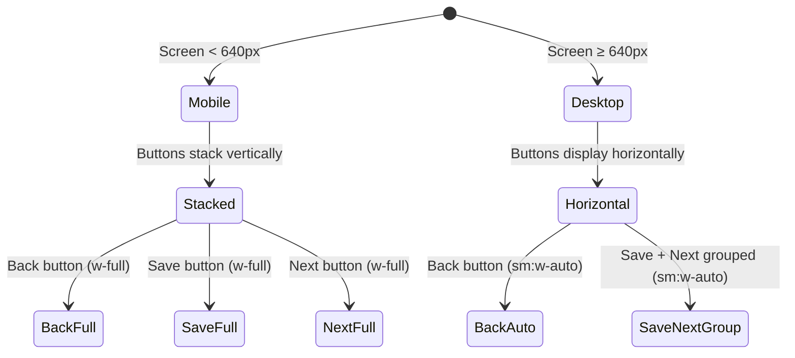

---

## Error Handling

### Validation Error Flow

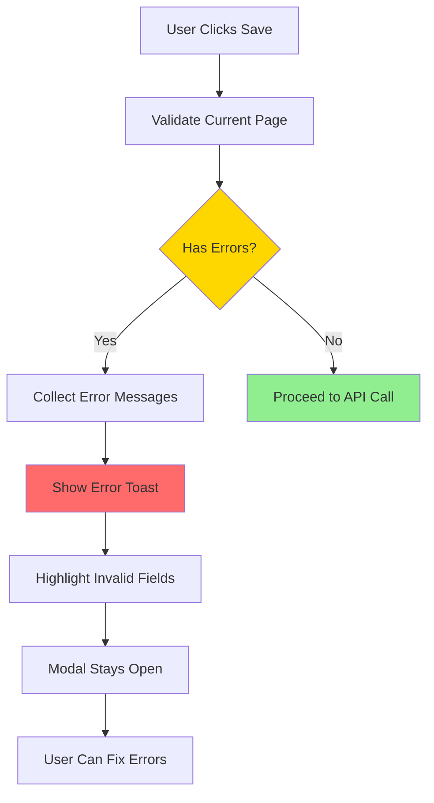

### API Error Handling

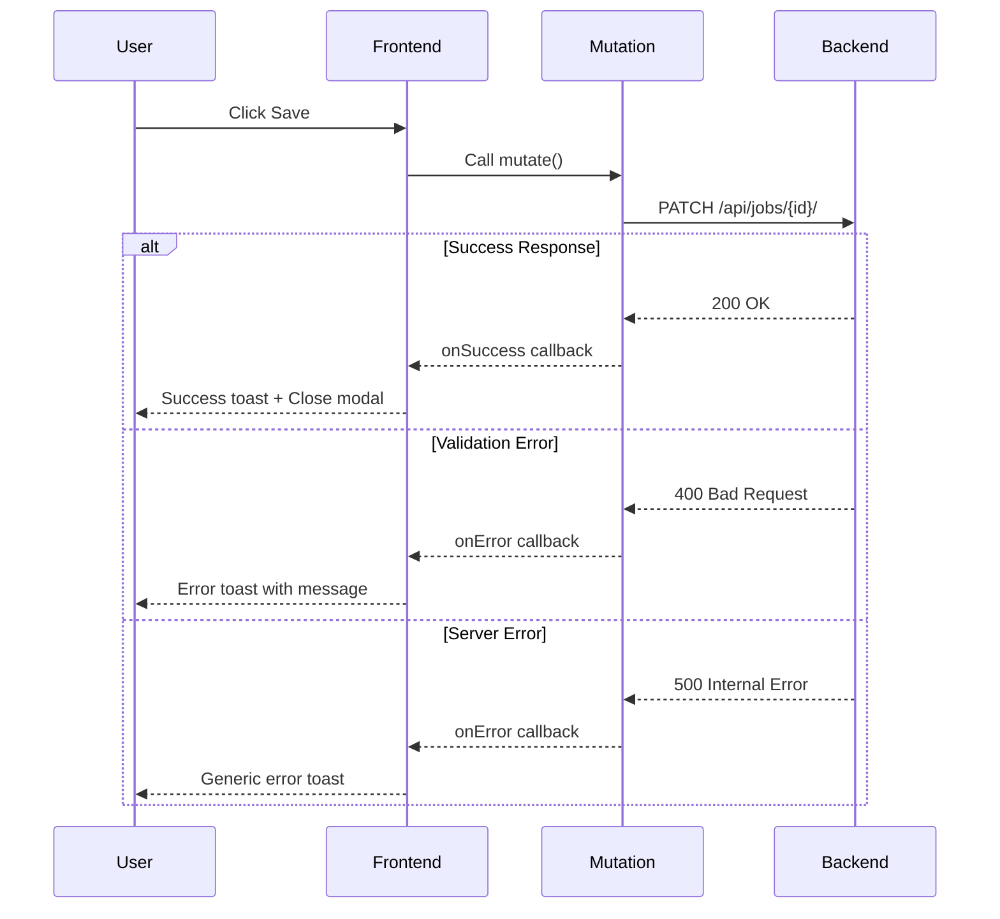

### Common Error Scenarios

| Error | Cause | Solution |
|-------|-------|----------|
| "Cannot read properties of undefined (reading 'join')" | Array field is undefined when calling .join() | Add defensive checks: `if (field && Array.isArray(field))` |
| "This field may not be blank" | Required backend field not sent | Preserve existing DB values or send valid data |
| "Please fix the errors on this page" | Validation failed on current page | User must fix validation errors before saving |

---

## Implementation Details

### Modified Files

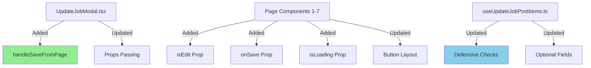

### Key Changes

#### 1. UpdateJobModal.tsx

**Added:**
- `handleSaveFromPage` function
- Props passing to all page components

```typescript
{pageNumber === 1 && (
  <CreateJobPageJobTitleInfo
    firstForm={firstForm}
    firstFormSubmit={firstFormSubmit}
    setJobPostData={setJobPostData}
    isEdit={true}
    onSave={() => handleSaveFromPage(1, firstForm)}
    isLoading={isLoading}
  />
)}
```

#### 2. Page Components (Pages 1-7)

**Added:**
- New prop types
- Save button in footer
- Conditional rendering based on `isEdit`

```typescript
export default function CreateJobPageJobTitleInfo({
  firstForm,
  firstFormSubmit,
  setJobPostData,
  isEdit,      // NEW
  onSave,      // NEW
  isLoading    // NEW
}: {
  firstForm: any;
  firstFormSubmit: any;
  setJobPostData: any;
  isEdit?: boolean;        // NEW
  onSave?: () => void;     // NEW
  isLoading?: boolean;     // NEW
}) {
  // Component logic
}
```

#### 3. useUpdateJobPostItems.ts

**Updated:**
- Made all fields optional
- Added defensive checks before `.join()`
- Only send fields with values (proper PATCH behavior)

**Before:**
```typescript
formData.append('job_type', jobPost.jobType.join());
```

**After:**
```typescript
if (jobPost.jobType && Array.isArray(jobPost.jobType)) {
  formData.append('job_type', jobPost.jobType.join());
}
```

---

## Testing Guide

### Manual Testing Checklist

#### Test Case 1: Save from Page 1

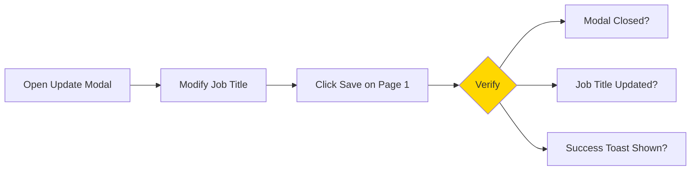

**Steps:**
1. Open job posting update modal
2. Modify job title on Page 1
3. Click **Save** button
4. **Expected:**
   - Modal closes
   - Job title updated in job list
   - Success toast appears

#### Test Case 2: Save from Page 3 (Salary)

**Steps:**
1. Open update modal
2. Navigate to Page 3
3. Modify salary range
4. Click **Save** button
5. **Expected:**
   - Modal closes
   - Salary updated
   - Previous pages' data preserved

#### Test Case 3: Validation Error

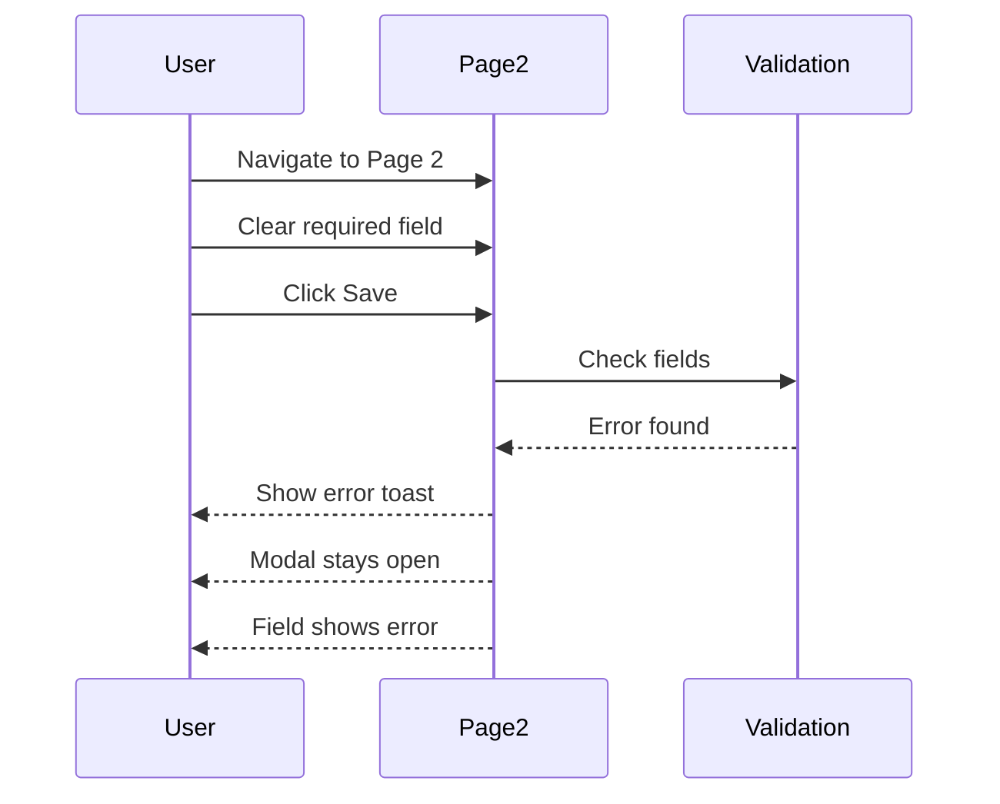

**Steps:**
1. Navigate to Page 2
2. Clear a required field (e.g., hire count)
3. Click **Save** button
4. **Expected:**
   - Error toast: "Please fix the errors on this page"
   - Modal stays open
   - Field shows validation error

#### Test Case 4: Loading State

**Steps:**
1. Click **Save** button
2. **During API call:**
   - Button shows "Saving..."
   - Button is disabled
3. **After success:**
   - Modal closes

#### Test Case 5: Button Layout

**Verify on each page:**
- Page 1: No Back button, Save + Next on right
- Pages 2-7: Back on left, Save + Next grouped on right
- Responsive: Stack vertically on mobile

### Automated Testing

```typescript
describe('Job Posting Save on Each Page', () => {
  it('should save from Page 1', async () => {
    // 1. Open modal in edit mode
    // 2. Fill Page 1 data
    // 3. Click Save
    // 4. Assert API called with correct data
    // 5. Assert modal closed
  });

  it('should validate before saving', async () => {
    // 1. Open modal
    // 2. Clear required field
    // 3. Click Save
    // 4. Assert error toast shown
    // 5. Assert modal stays open
  });

  it('should preserve accumulated data', async () => {
    // 1. Fill Page 1 data
    // 2. Navigate to Page 2
    // 3. Fill Page 2 data
    // 4. Navigate to Page 3
    // 5. Click Save
    // 6. Assert API receives data from pages 1, 2, and 3
  });
});
```

---

## Performance Considerations

### Data Merging Strategy

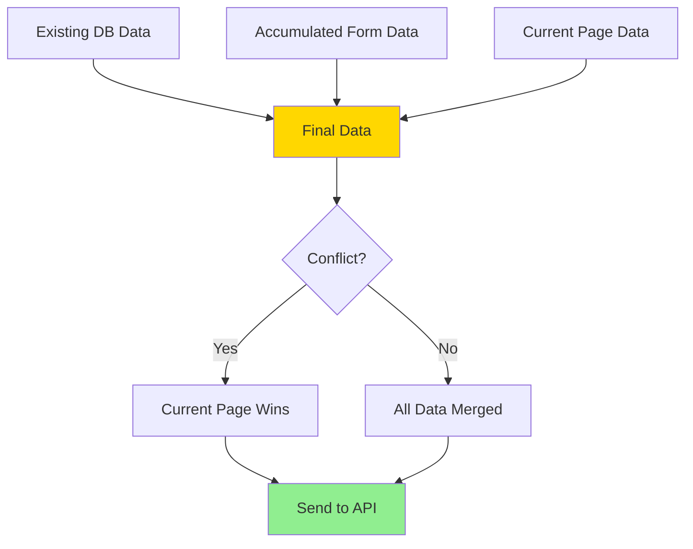

**Merge Order Priority:**
1. **Existing DB Data** (lowest priority) - Preserves required fields
2. **Accumulated Data** (medium priority) - Data from previously visited pages
3. **Current Page Data** (highest priority) - User's latest changes

### API Optimization

- **PATCH vs PUT**: Using PATCH allows partial updates
- **Only Send Changed Fields**: Reduces payload size
- **FormData for Files**: Efficiently handles file uploads

---

## Troubleshooting

### Common Issues

#### Issue 1: "Cannot read properties of undefined"

**Cause:** Trying to call `.join()` on undefined array

**Solution:**
```typescript
// Before
formData.append('job_type', jobPost.jobType.join());

// After
if (jobPost.jobType && Array.isArray(jobPost.jobType)) {
  formData.append('job_type', jobPost.jobType.join());
}
```

#### Issue 2: "This field may not be blank"

**Cause:** Backend requires field but it's not sent

**Solution:**
```typescript
// Preserve existing required fields
const existingData: any = {};
if (jobPostDataDetails?.shared_to) {
  existingData.shared_to = jobPostDataDetails.shared_to.split(',');
}

const finalData = { ...existingData, ...combinedFormData, ...processedData };
```

#### Issue 3: Save button appears in middle

**Cause:** `justify-between` spreads buttons apart

**Solution:**
```tsx
{/* Wrap Save and Next in container */}
<div className='flex gap-3 flex-row-reverse'>
  <button>Next</button>
  <button>Save</button>
</div>
```

---

## Future Enhancements

### Potential Improvements

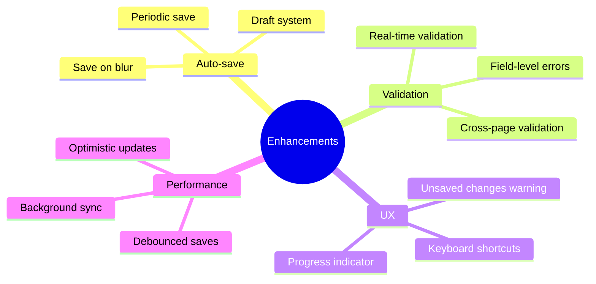

### Draft System Concept

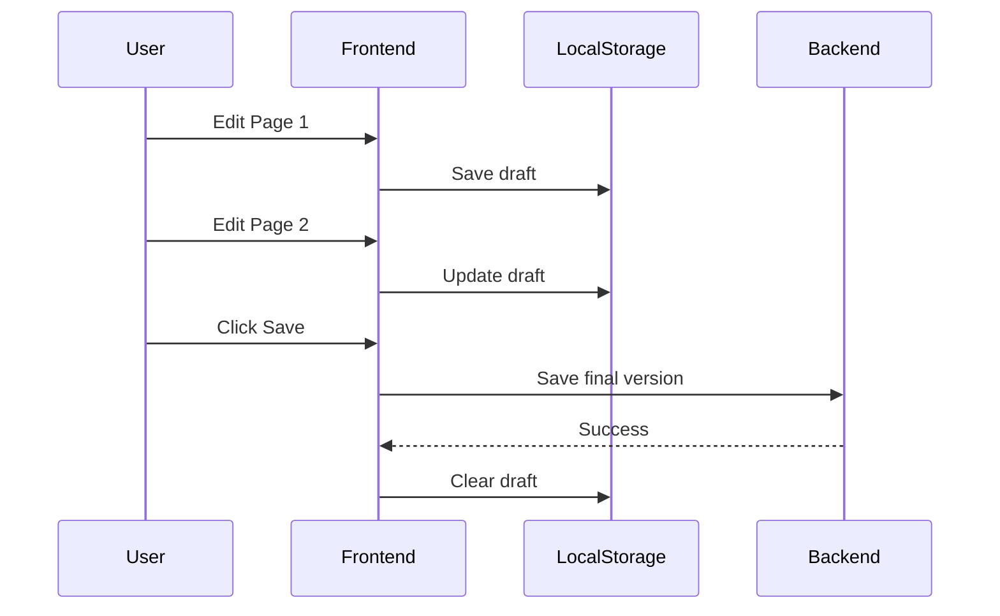

---

## Conclusion

This implementation provides a flexible, user-friendly approach to editing job postings by allowing saves from any page while maintaining data integrity through:

1. **Page-level validation** - Only current page validated before save
2. **Data accumulation** - Preserves data from all visited pages
3. **Defensive programming** - Handles missing/optional fields gracefully
4. **Clear UX** - Consistent button layout across all pages
5. **Error handling** - Comprehensive error messages and states

The solution balances user convenience with data safety, ensuring a smooth editing experience.
