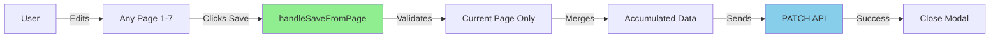
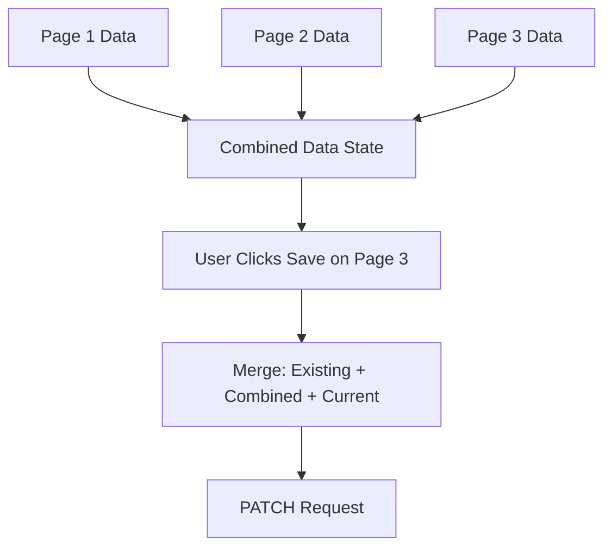
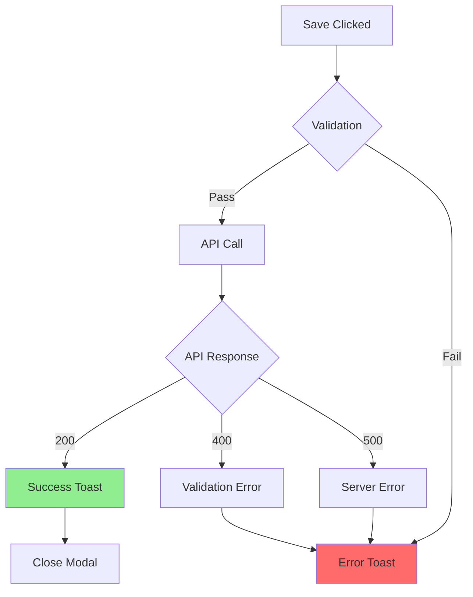

# Job Posting Save - Quick Reference Guide

## Overview

Save job posting updates from any page without navigating through all 8 pages.

---

## Architecture at a Glance



---

## Data Flow



**Merge Priority:**
1. Existing DB Data (preserved required fields)
2. Accumulated Data (pages 1-2)
3. Current Page Data (latest changes)

---

## Save Handler Logic

```typescript
// UpdateJobModal.tsx
const handleSaveFromPage = (pageNum, pageForm) => {
  pageForm.handleSubmit(
    (validData) => {
      // 1. Process page-specific data
      let processedData = { ...validData };

      // 2. Preserve existing required fields
      const existingData = {
        shared_to: jobPostDataDetails?.shared_to?.split(',')
      };

      // 3. Merge layers
      const finalData = {
        ...existingData,      // Layer 1
        ...combinedFormData,  // Layer 2
        ...processedData      // Layer 3
      };

      // 4. Call API
      mutate({jobPost: finalData, job_post_id: id}, callback);
    },
    (errors) => {
      toast.error("Please fix the errors on this page");
    }
  )();
};
```

---

## Button Layout

### Pages 2-7 Structure

```html
<div className='sm:flex justify-between'>
  <button>Back</button>
  <div className='flex gap-3 flex-row-reverse'>
    <button>Next</button>
    {isEdit && <button onClick={onSave}>Save</button>}
  </div>
</div>
```

### Visual Layout

```
┌─────────────────────────────────────┐
│ [Back]        [Save]  [Next]        │
└─────────────────────────────────────┘
```

---

## Key Files Modified

| File | Changes |
|------|---------|
| `UpdateJobModal.tsx` | Added `handleSaveFromPage` handler |
| `CreateJobPageJobTitleInfo.tsx` (Page 1) | Added Save button, props |
| `CreateJobPageJobType.tsx` (Page 2) | Added Save button, props |
| `CreateJobPageSalary.tsx` (Page 3) | Added Save button, props |
| `CreateJobPageJobDescription.tsx` (Page 4) | Added Save button, props |
| `CreateJobPageJobSettings.tsx` (Page 5) | Added Save button, props |
| `CreateJobPagePostAs.tsx` (Page 6) | Added Save button, props |
| `CreateJobPagePreview.tsx` (Page 7) | Added Save button, props |
| `useUpdateJobPostItems.ts` | Made fields optional with defensive checks |

---

## Error Handling



---

## Testing Checklist

- [ ] Save from Page 1 - job title updates
- [ ] Save from Page 2 - job type updates
- [ ] Save from Page 3 - salary updates
- [ ] Save from Page 4 - description updates
- [ ] Save from Page 5 - settings updates
- [ ] Save from Page 6 - post as updates
- [ ] Save from Page 7 - preview confirmation
- [ ] Validation errors show toast
- [ ] Modal closes on success
- [ ] Loading state shows "Saving..."
- [ ] Button layout correct on all pages
- [ ] Responsive layout works

---

## Common Errors & Solutions

| Error | Solution |
|-------|----------|
| `Cannot read 'join' of undefined` | Add: `if (field && Array.isArray(field))` |
| `This field may not be blank` | Preserve existing DB values |
| Save button in middle | Wrap Save+Next in `<div className='flex gap-3'>` |

---

## Props Added to Pages

```typescript
interface PageProps {
  // ... existing props
  isEdit?: boolean;      // NEW: Indicates edit mode
  onSave?: () => void;   // NEW: Save handler
  isLoading?: boolean;   // NEW: Loading state
}
```

---

## Usage Example

```tsx
// In UpdateJobModal.tsx
<CreateJobPageSalary
  watch={thirdForm.watch}
  register={thirdForm.register}
  setValue={thirdForm.setValue}
  // ... other props
  isEdit={true}                                    // NEW
  onSave={() => handleSaveFromPage(3, thirdForm)} // NEW
  isLoading={isLoading}                            // NEW
/>
```

---

## API Call Pattern

```typescript
// useUpdateJobPostItems.ts
async function updateJobPost(jobPost: any, job_post_id: string) {
  const formData = new FormData();

  // Only append fields that exist (PATCH pattern)
  if (jobPost.jobType && Array.isArray(jobPost.jobType)) {
    formData.append('job_type', jobPost.jobType.join());
  }

  if (jobPost.shared_to && Array.isArray(jobPost.shared_to)) {
    formData.append('shared_to', jobPost.shared_to.join());
  }

  // PATCH request
  const res = await fetch(
    `${API_URL}/api/jobs/${job_post_id}/`,
    { method: 'PATCH', body: formData }
  );

  return res.json();
}
```

---

## State Management

```typescript
// UpdateJobModal.tsx
const [combinedFormData, setCombinedFormData] = useState({});
const [pageNumber, setPageNumber] = useState(1);

// Accumulate data when moving to next page
const firstFormSubmit = (data) => {
  setCombinedFormData((prev) => ({ ...prev, ...data }));
  setPageNumber(2);
};

// Save from any page
const handleSaveFromPage = (pageNum, form) => {
  // Merges accumulated + current page data
};
```

---

## Responsive Behavior

| Screen Size | Layout |
|-------------|--------|
| Mobile (< 640px) | Buttons stack vertically, full width |
| Desktop (≥ 640px) | Buttons horizontal, auto width |

---

## Performance Notes

- **Partial Updates**: Only sends changed fields via PATCH
- **No Unnecessary Rerenders**: Uses React Hook Form's isolated field updates
- **Efficient State**: Accumulates data without page reloads

---

## Success Criteria

✅ Save button on Pages 1-7
✅ Validates current page only
✅ Preserves accumulated data
✅ Handles missing/optional fields
✅ Shows loading state
✅ Closes modal on success
✅ Consistent button layout
✅ Responsive design

---

## Related Documentation

- [Full Implementation Guide](./job-posting-save-on-each-page.md)
- [React Hook Form Docs](https://react-hook-form.com/)
- [TanStack Query Docs](https://tanstack.com/query/latest)
