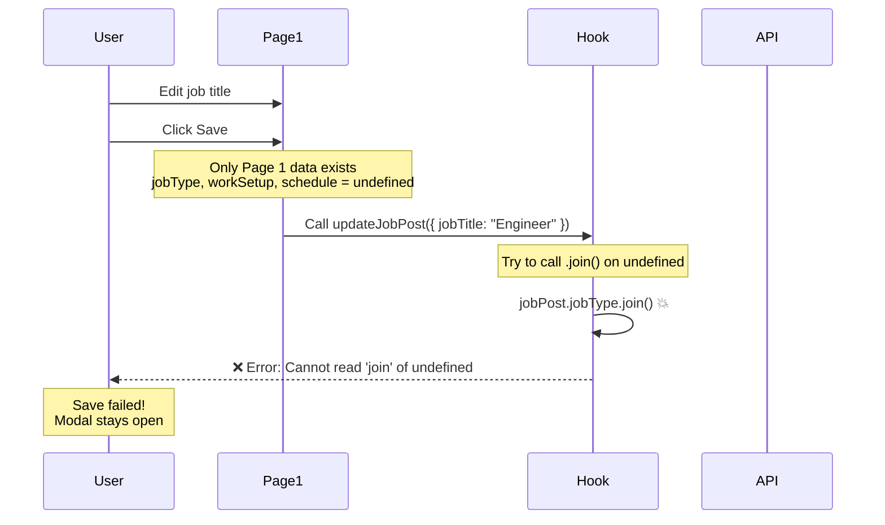
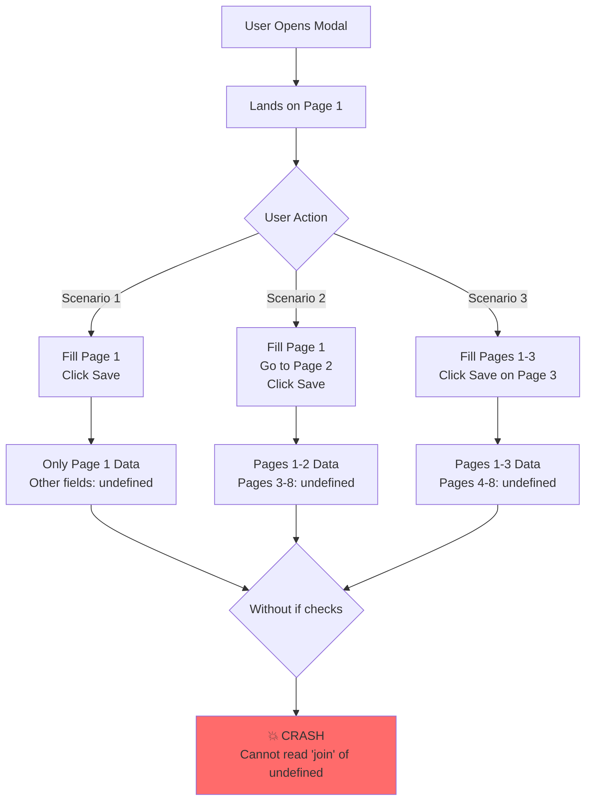
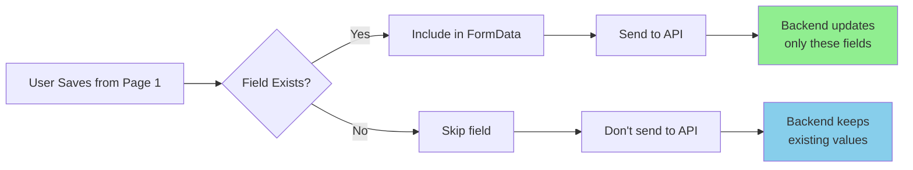
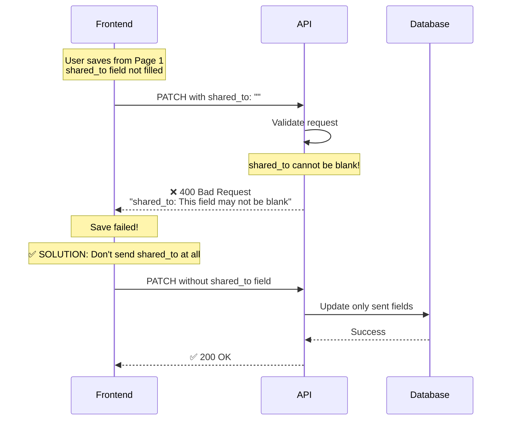
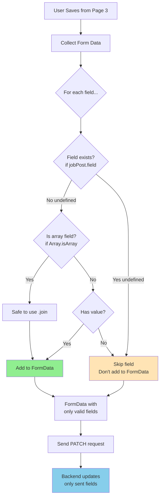
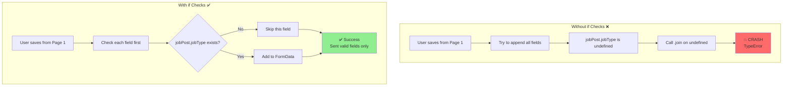
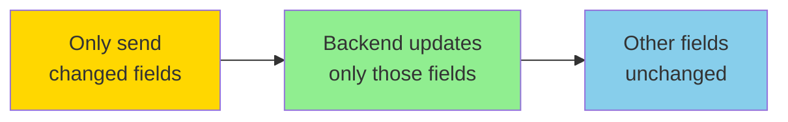
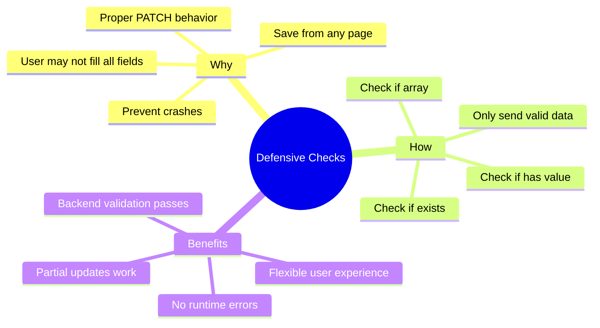

# Why FormData Fields Are Wrapped in `if` Statements

## Location
`yahshua-hris-fe\src\components\pages\(auth)\employer\job-posting-history\hooks\useUpdateJobPostItems.ts`

---

## Table of Contents
- [The Problem](#the-problem)
- [Why Defensive Checks Are Needed](#why-defensive-checks-are-needed)
- [PATCH vs PUT HTTP Methods](#patch-vs-put-http-methods)
- [Code Examples](#code-examples)
- [Visual Explanation](#visual-explanation)
- [Benefits](#benefits)

---

## The Problem

### Before: Without Defensive Checks

```typescript
// ❌ UNSAFE CODE (Original implementation)
async function updateJobPost(jobPost: any, job_post_id: string) {
  const formData = new FormData();

  // Always appended, even if undefined
  formData.append('job_type', jobPost.jobType.join());        // 💥 Crashes!
  formData.append('work_setup', jobPost.workSetup.join());    // 💥 Crashes!
  formData.append('job_schedule', jobPost.schedule.join());   // 💥 Crashes!
  formData.append('shared_to', '');                           // 🐛 Sends empty string

  // Send request
  await fetch(`${API_URL}/api/jobs/${id}/`, { method: 'PATCH', body: formData });
}
```

### What Happens When User Saves from Page 1?



**Error Message:**
```
TypeError: Cannot read properties of undefined (reading 'join')
at updateJobPost (useUpdateJobPostItems.ts:18)
```

---

## Why Defensive Checks Are Needed

### Reason 1: Save from Any Page Feature

With the new "save from any page" feature, users can save from **Pages 1-7** without filling all fields.



### Reason 2: Proper PATCH Request Behavior

**PATCH** = Partial Update (send only changed fields)
**PUT** = Full Replacement (send all fields)

Since we're using **PATCH**, we should only send fields that:
- ✅ Exist (not undefined)
- ✅ Have values (not empty)
- ✅ Were actually filled by the user



### Reason 3: Prevent Backend Validation Errors

Some fields are **required** by the backend. If we send empty strings or invalid data, the backend rejects the request.



---

## PATCH vs PUT HTTP Methods

### PUT Request (Full Replacement)

```typescript
// PUT requires ALL fields
const data = {
  job_title: "Engineer",          // ✅ Provided
  job_type: undefined,             // ❌ Missing - backend will set to null/empty
  work_setup: undefined,           // ❌ Missing - backend will set to null/empty
  schedule: undefined,             // ❌ Missing - backend will set to null/empty
  salary: undefined,               // ❌ Missing - backend will set to null/empty
  // ... all other fields
};

// Backend replaces ENTIRE resource
// Result: All undefined fields become null/empty ⚠️
```

### PATCH Request (Partial Update)

```typescript
// PATCH sends only changed fields
const data = {
  job_title: "Engineer",          // ✅ Only this field
};

// Backend updates ONLY sent fields
// Result: Other fields remain unchanged ✅
```

### Comparison Table

| Aspect | PUT | PATCH |
|--------|-----|-------|
| **Purpose** | Replace entire resource | Update specific fields |
| **Required Fields** | All fields | Only fields being updated |
| **Undefined Fields** | Become null/empty | Not sent, keep existing values |
| **Safety** | Can accidentally clear data | Safer for partial updates |
| **Use Case** | Full form submission | Quick edits, save from any page |

---

## Code Examples

### Example 1: Page 1 Data Only

**User saves from Page 1:**

```typescript
// Data sent from frontend
const jobPost = {
  jobTitle: "Software Engineer",
  country: "Philippines",
  language: "English",
  position: 1,
  placeAdvertise: ["Manila", "Quezon City"],
  // Everything else is undefined
};

// Without if checks (CRASHES):
formData.append('job_type', jobPost.jobType.join());  // 💥 undefined.join()

// With if checks (SAFE):
if (jobPost.jobType && Array.isArray(jobPost.jobType)) {
  formData.append('job_type', jobPost.jobType.join());  // ✅ Skipped
}
```

**FormData sent to API:**
```
job_title: "Software Engineer"
country: "Philippines"
language: "English"
position: 1
advertise_to: "Manila,Quezon City"
// job_type NOT sent - will keep existing value in database
// work_setup NOT sent - will keep existing value in database
// schedule NOT sent - will keep existing value in database
```

### Example 2: Pages 1-3 Data

**User saves from Page 3:**

```typescript
const jobPost = {
  // Page 1
  jobTitle: "Software Engineer",
  country: "Philippines",

  // Page 2
  jobType: ["Full-time", "Permanent"],
  workSetup: ["On-site"],
  schedule: ["Day shift"],

  // Page 3
  salary: {
    salaryType: "Range",
    salaryRangeMin: 30000,
    salaryRangeMax: 50000
  },
  rate: "Monthly",
  benefits: ["Health insurance", "Paid training"],

  // Pages 4-8 are undefined
};

// With if checks:
if (jobPost.jobType && Array.isArray(jobPost.jobType)) {
  formData.append('job_type', jobPost.jobType.join());  // ✅ Sent
}

if (jobPost.jobDescription) {
  formData.append('job_description', jobPost.jobDescription);  // ✅ Skipped (undefined)
}

if (jobPost.screeningQuestions && Array.isArray(jobPost.screeningQuestions)) {
  formData.append('screening_questions', JSON.stringify(jobPost.screeningQuestions));  // ✅ Skipped (undefined)
}
```

**FormData sent to API:**
```
job_title: "Software Engineer"
country: "Philippines"
job_type: "Full-time,Permanent"
work_setup: "On-site"
job_schedule: "Day shift"
salary_range_type: "Range"
minimum_amount: 30000
maximum_amount: 50000
rate: "Monthly"
offered_benefits: "Health insurance,Paid training"
// job_description NOT sent
// qualifications NOT sent
// screening_questions NOT sent
// shared_to NOT sent
```

### Example 3: Array Field with .join()

**Why we need both checks:**

```typescript
// Check 1: Does field exist?
// Check 2: Is it an array?
if (jobPost.jobType && Array.isArray(jobPost.jobType)) {
  formData.append('job_type', jobPost.jobType.join());
}
```

**Possible scenarios:**

```typescript
// Scenario 1: Undefined
jobPost.jobType = undefined;
// Result: Skipped ✅ (both checks fail)

// Scenario 2: Empty array
jobPost.jobType = [];
// Result: Sent as empty string "" ✅ (both checks pass)

// Scenario 3: Valid array
jobPost.jobType = ["Full-time", "Permanent"];
// Result: Sent as "Full-time,Permanent" ✅ (both checks pass)

// Scenario 4: Not an array (edge case)
jobPost.jobType = "Full-time";  // Should be array but isn't
// Result: Skipped ✅ (second check fails, prevents crash)
```

---

## Visual Explanation

### Data Flow with Defensive Checks



### Comparison: With vs Without Checks



---

## Benefits

### 1. Prevents Runtime Crashes

```typescript
// ❌ Without checks
formData.append('job_type', jobPost.jobType.join());  // Crash if undefined

// ✅ With checks
if (jobPost.jobType && Array.isArray(jobPost.jobType)) {
  formData.append('job_type', jobPost.jobType.join());  // Safe
}
```

### 2. Proper PATCH Semantics



### 3. Avoids Backend Errors

```typescript
// ❌ Without checks
formData.append('shared_to', '');  // Backend: "This field may not be blank"

// ✅ With checks
if (jobPost.shared_to && Array.isArray(jobPost.shared_to) && jobPost.shared_to.length > 0) {
  formData.append('shared_to', jobPost.shared_to.join());  // Only if has value
}
// If empty, don't send - backend keeps existing value
```

### 4. Flexible User Flow

```typescript
// User can save from ANY page
// We only send what they've filled so far

// Save from Page 1:
// ✅ Sends: jobTitle, country, language
// ✅ Skips: jobType, salary, benefits, etc.

// Save from Page 3:
// ✅ Sends: jobTitle, country, jobType, salary
// ✅ Skips: screeningQuestions, shared_to, etc.
```

### 5. Type Safety

```typescript
// Defensive checks provide type safety
if (jobPost.jobType && Array.isArray(jobPost.jobType)) {
  // TypeScript knows jobPost.jobType is an array here
  formData.append('job_type', jobPost.jobType.join());  // ✅ Safe
}

// Even handles edge cases
if (jobPost.hireCount) {
  formData.append('required_slot', jobPost.hireCount.toString());  // ✅ Safe
}
```

---

## Exception: Fields Always Sent

Not all fields have `if` checks. Some fields are **always sent** because they have defaults:

```typescript
// Boolean flags - always have a value (true or false)
formData.append('is_show_roles', jobPost.is_show_roles === true ? 'true' : 'false');
formData.append('is_show_remarks', jobPost.is_show_remarks === true ? 'true' : 'false');
formData.append('is_show_salary', jobPost.is_show_salary === true ? 'true' : 'false');
formData.append('is_show_benefits', jobPost.is_show_benefits === true ? 'true' : 'false');

// Open Graph metadata - has defaults
formData.append('og_url', `${window.location.protocol}//${window.location.host}/jobs/`);
formData.append('og_type', 'article');
formData.append('og_image_width', '300');
formData.append('og_image_height', '300');

// Auto-reject setting - has default
if (jobPost.autoRejectEnabled !== undefined) {
  formData.append('auto_reject_enabled', jobPost.autoRejectEnabled.toString());
} else {
  formData.append('auto_reject_enabled', 'true');  // Default to true
}

// Screening questions - always sent (empty array if none)
if (jobPost.screeningQuestions && Array.isArray(jobPost.screeningQuestions) && jobPost.screeningQuestions.length > 0) {
  formData.append('screening_questions', JSON.stringify(formattedQuestions));
} else {
  formData.append('screening_questions', JSON.stringify([]));  // Send empty array
}
```

**Why these fields are always sent:**
- They have **default values**
- They are **boolean flags** (always true or false)
- They need to be **explicitly set** even if empty

---

## Summary

### The Core Principle



### Key Takeaways

1. **`if` checks prevent crashes** when fields are undefined
2. **PATCH requires flexibility** - only send what exists
3. **Save from any page** means incomplete data is normal
4. **Defensive programming** makes code robust
5. **Type safety** is maintained through checks

### Before and After

| Without Checks | With Checks |
|----------------|-------------|
| ❌ Crashes on undefined | ✅ Skips undefined safely |
| ❌ Sends empty strings | ✅ Omits empty fields |
| ❌ Backend validation errors | ✅ Backend accepts request |
| ❌ Must fill all pages | ✅ Save from any page |
| ❌ Fragile code | ✅ Robust code |

---

## Conclusion

The `if` statements wrapping FormData fields are **essential defensive checks** that enable the "save from any page" feature while maintaining code safety and proper PATCH request semantics.

Without them, the application would crash whenever users try to save from early pages, making the feature unusable.

**In short:** `if` checks = Safe, flexible, robust code ✅
